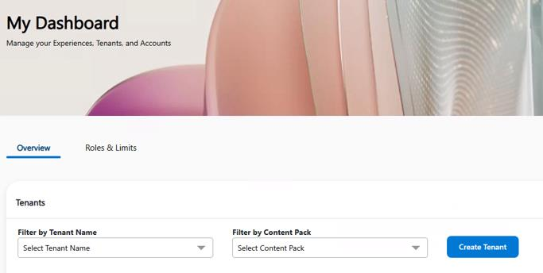
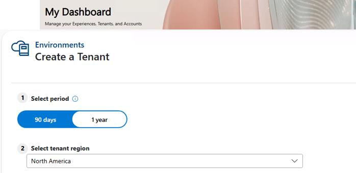
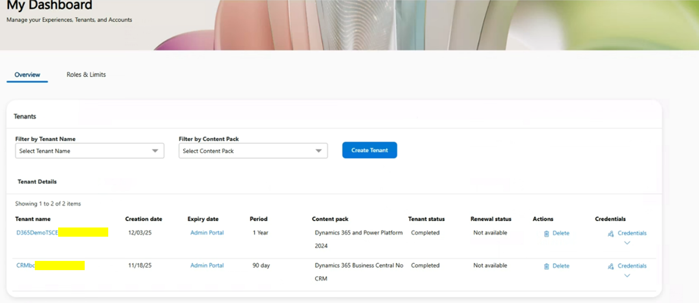
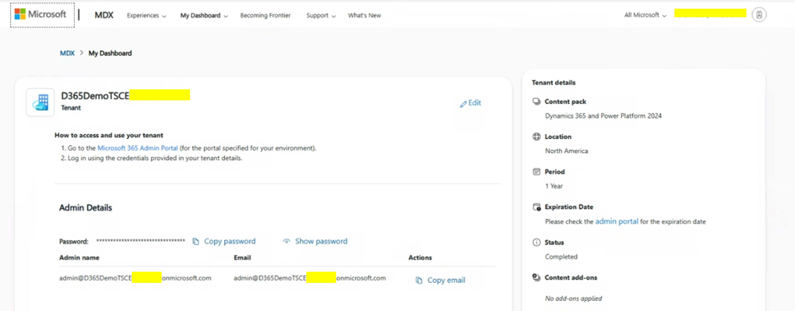

## Task 01: Connect to the MDX website and create a tenant

Before you create a demo environment you must request a tenant.

There are limitations to the number of demo tenants that you can claim. Demo tenants expire. You can request an extension for a demo tenant. You can delete existing tenants.

{: .note }
> If you require support deleting, updating, or extending a tenant, [submit a request](https://cdx.transform.microsoft.com/submit-request) to the MDX support team.

### Key steps

1. On a device that is authorized to run Microsoft corporate resources, open Microsoft Edge and go to [Microsoft CDX](https://cdx.transform.microsoft.com).

1. Sign in by using your Microsoft employee (or V-) credentials.

1. On the command bar, select **My Dashboard** and then select **Overview**.

1. Select **Create Tenant**.

    

1. On the Create a Tenant page, in the **Select period** field, select **1 year**. In the **Select tenant region** field, select the region that is geographically closest to you.

    

1. Select **Create Tenant**. Wait for provisioning to complete.

1. On the My Dashboard page, select your tenant to view details.

    

1. The Details page for the tenant you selected displays. This data is used to fill in details later in the lab instructions.

    

    

    
Expand here for detailed steps

    1. In the Power Platform admin center, select **Settings** > **Users + permissions** > **Users**.
    1. Search for your user account.
    1. Confirm the **System Administrator** role is assigned.

    

---

[Task 02 →](00_02.html){: .btn .btn-purple }
