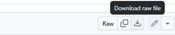

## Task 02: Download files from GitHub repository

For some of the workshops that this prerequisite lab supports, you will need some preconfigured files.

In this task, you will download the files from a GitHub repository.

### Key steps

1. Open a browser and go to `https://github.com/skillable-custom-lab-development/40-505-52/blob/main/Dynamics%20365%20Labs.zip`.

1. On the command bar for the Dynamics 365 Labs.zip file, select **Download raw file**.

    

1. Extract the compressed (zipped) folder and place the files in a folder of your choosing.

---

[← Task 01](00_01.html){: .btn .mr-2 }
[Task 03 →](00_03.html){: .btn .btn-purple }
