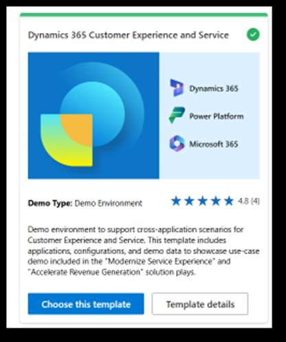
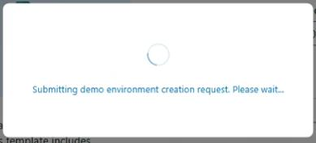
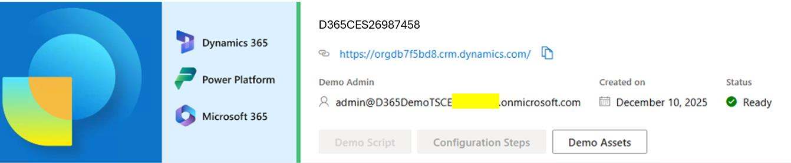

## Task 01: Deploy the demo environment

1. In the virtual machine, open Microsoft Edge and go to `https://bizappsdemos.microsoft.com/`.

2. Sign in by using your Microsoft employee (or V-) credentials.

3. Locate the **Dynamics 365 Customer Experience and Service** tile and select **Choose this template**.

    

4. Configure the demo experience by using the following information and then select **Submit**:

    | Field | Value |
    | --- | --- |
    | Name your environment | `<YourEnvironmentName>` |
    | Enter your 12-month dedicated admin credentials | `admin@<YourTenantName>.onmicrosoft.com` |
    | Location | North America |

    

5. Verify that the request is being submitted.

    

    > 
    >   The process of submitting your request to the queue can take several minutes. It may take one to two hours for environment provisioning to complete.

    > 

6. The Demo Hub page shows your environment. Verify that your environment status is set to **Ready**.

    

7. Note the environment details from the Demo Hub page for use in subsequent tasks.

    > 
    >   The password for the demo environment is automatically generated and will be different from the password for the MDX tenant. You'll need to use the password for the demo environment for the subsequent tasks.

    > 

---
