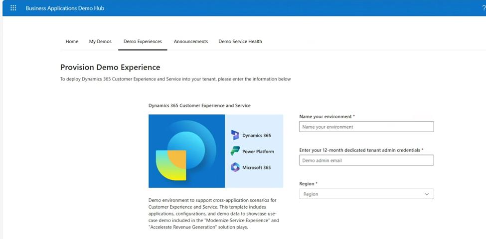

# Exercise 02: Create an environment for the *Sales Transformation with AI* workshop

You've selected the **Configure and extend the Sales Qualification agent and the Sales Research agent** workshop. In this exercise, you'll provision a tenant for the workshop.

Once you successfully complete the exercise, you'll be provided with a link so that you can register for the workshop.

**Estimated time to complete this exercise**: 

- Hands-on: 3-5 minutes

- Provisioning of environment: 2-3 hours

## - Wait time for addition of Copilot licenses: 24 hours

## Task 01: Deploy the demo environment

-  In the virtual machine, open Microsoft Edge and go to `https://bizappsdemos.microsoft.com/`.

-  Sign in by using your Microsoft employee (or V-) credentials.

-  Locate the **Dynamics 365 Customer Experience and Service** tile and select **Choose this template**.

-  Configure the demo experience by using the following information and then select **Submit**:

| Field | Value |

| Name your environment | D365CES60084966 |

| Enter your 12-month dedicated admin credentials | admin@D365DemoTSCE13056416.onmicrosoft.com |

| Location | North America |

-  Verify that the request is being submitted.

> 
>   The process of submitting your request to the queue can take several minutes. It may take one to two hours for environment provisioning to complete.

> 

-  The Demo Hub page shows your environment. Verify that the **D365CES60084966** environment status is set to **Ready**.

-  Copy values from the page and paste the values into the following text fields. This data is used to fill in details later in the lab instructions. 

> 
>   You must provide data for both fields before you can continue with this lab.

> 

| Field | Value |

| Deployment URL: |  |

| Status: |  |

> 
>   The username for the **FandOPPAC60084966** demo environment is the same as the username you created for the MDX tenant.

>   The password for the demo environment is automatically generated and will be different from the password for the MDX tenant. You'll need to use the password for the demo environment for the subsequent tasks.

> 

-  Select **Validate my information**. This step is required before you can proceed.

---
