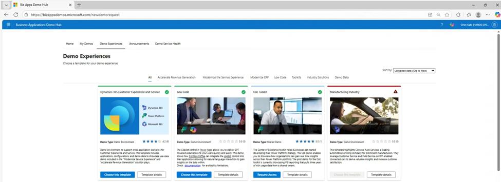
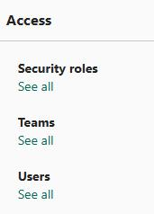
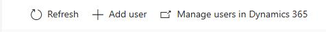
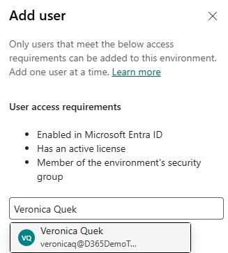
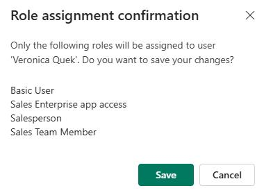

## Task 02: Add required users to the environment

Before you create agents, you need to add users to your organization. In this task, you'll add users to the demo environment.

**Estimated time to complete this task**: 

- Hands-on: 15-20 minutes

> 
>   As part of provisioning the demo environment, the system may have added some users for you. As you work through this task, if a user already exists, check to see that it's set up according to these steps. Add new users as needed.

> 

1. Open a web browser and go to `aka.ms/ppac`.

2. Sign in by using your demo admin credentials for the tenant that you created in Exercise 01.

    

3. In the left pane, select **Manage**.

    

4. In the **Manage** pane, select **Environments**.

    

5. On the **Environments** page, select your demo environment.

6. On the details page for the environment, in the **Access** section, under **Users**, select **See all**.

    

7. Compare the list of users in the table below with the list of users that are associated with the environment. 

    > 
    >   If a user is listed in the table below but is not in the list of users associated with the environment, follow steps 8-12 below to add each missing user. 

    > 

    | Name | Sales Org | Job Title | Reports To | Territory | Territory Mgr | Region |
    | --- | --- | --- | --- | --- | --- | --- |
    | `Nancy Warner` | nancyw@yourdomain.com | Sales Manager |  |  |  | Americas |
    | `Jeremy Johnson` | jeremyj@yourdomain.com | Sales Representative | Nancy Warner | Northwest | Yes | NAM |
    | `Veronica Quek` | veronicaq@yourdomain.com | Sales Representative | Jeremy Johnson | Northwest |  | NAM |
    | `David Mallory` | davidm@yourdomain.com | Sales Representative | Nancy Warner | Southwest | Yes | NAM |
    | `Camille Cartier` | camille@yourdomain.com | Sales Representative | David Mallory | Southwest |  | NAM |
    | `Alan Steiner` | alans@yourdomain.com | Sales Representative | Nancy Warner | Central | Yes | NAM |
    | `Alicia Thomber` | aliciat@yourdomain.com | Sales Representative | Alan Steiner | Central |  | NAM |
    | `Amy Alberts` | amya@yourdomain.com | Sales Representative | Nancy Warner | Northeast | Yes | NAM |
    | `Spencer Low` | spencer@yourdomain.com | Sales Representative | Amy Alberts | Northeast |  | NAM |
    | `Anita Montero` | anitam@yourdomain.com | Sales Representative | Nancy Warner | Southeast | Yes | NAM |

8. On the command bar at the top of the page, select **+ Add user**.

    

9. In the **Add user** pane, enter the name of the user that you plan to add.

    

10. Select the username from the search results and then select **Add**.

    

    

11. Wait while the user is added. In the **Manage security roles** pane, assign the following roles and then select **Save**:

    **Nancy Warner**

    - Approvals User

    - Forecast manager

    - Sales Manager

    - **All other users**

    - Basic user

    - Sales enterprise app access

    - Salesperson

    - Sales team Member

12. In the **Role assignment confirmation** dialog, review the roles you assigned and then select **Save**.

    

13. Repeat steps 8-12 to add other users as required.

14. Leave Power Platform admin center open. You'll use the admin center again in the next task.

---

[← Task 01](01.md){: .btn .mr-2 }
[Task 03 →](03.md){: .btn .btn-purple }
