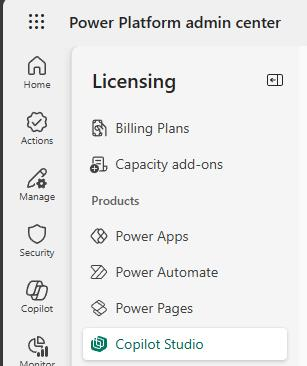
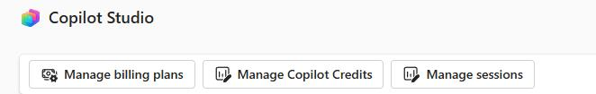
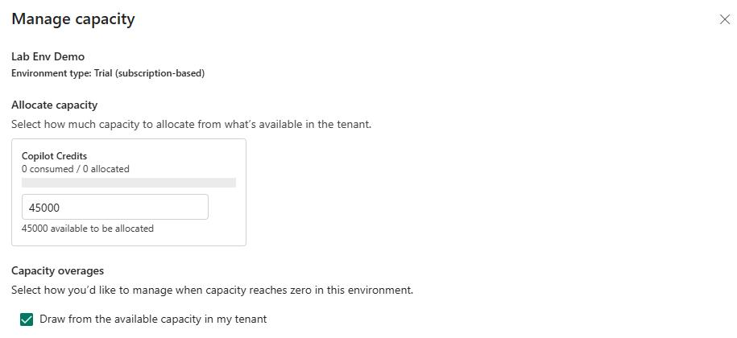

## Task 03: Add Copilot capacity credits

Sales agents use AI tokens to assist agents. In this task, you'll ensure that you dedicate Copilot Studio credits to your environment.

**Estimated time to complete this task**: 

- Hands-on: 3-5 minutes

1. Open a web browser and go to `aka.ms/ppac`.

2. Sign in by using your demo admin credentials for the tenant that you created in Exercise 01.

    

3. In the left pane, select **Licensing**.

    

4. On the **Licensing** page, select **Copilot Studio**.

    

5. In the **Copilot Studio** section, select **Manage Copilot Credits**.

    

6. In the **Manage capacity** pane, select your demo environment.

7. In the **Copilot Credits** field, enter the maximum available credits.

8. In the **Capacity overages** section, select **Draw from the available capacity in my tenant**.

    

    

9. Select **Save**.

---

[← Task 02](02.md){: .btn .mr-2 }
[Task 04 →](04.md){: .btn .btn-purple }
