# Configure app registration and email

In this section, you'll create an app registration and application user for the Sales Qualification agent, configure a shared mailbox, and enable auditing.

---

## Task 06: Create an app registration and application user

The app user is a proxy user that performs actions on behalf of the Sales Qualification agent. The agent will read and respond to communications using this user. Without configuring an app user and performing these steps, some features of the Sales Qualification agent will not work. 

### 01: Create the app registration

1. Open a web browser window and go to `https://portal.azure.com`.

2. Sign in by using the demo tenant administrative credentials:

    Admin name: `admin@<YourTenantName>.onmicrosoft.com` 

3. Search for `App registrations` and then select the **App registrations** service.

    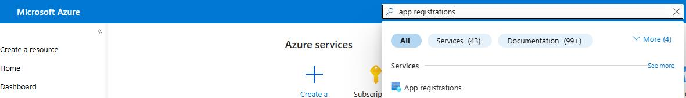

4. Select **+ New registration**.

    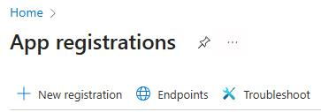

5. In the **Name** field, enter `Case agent`.

6. In the **Supported account types** section, select **Accounts in this organizational directory only (Single tenant)**.

    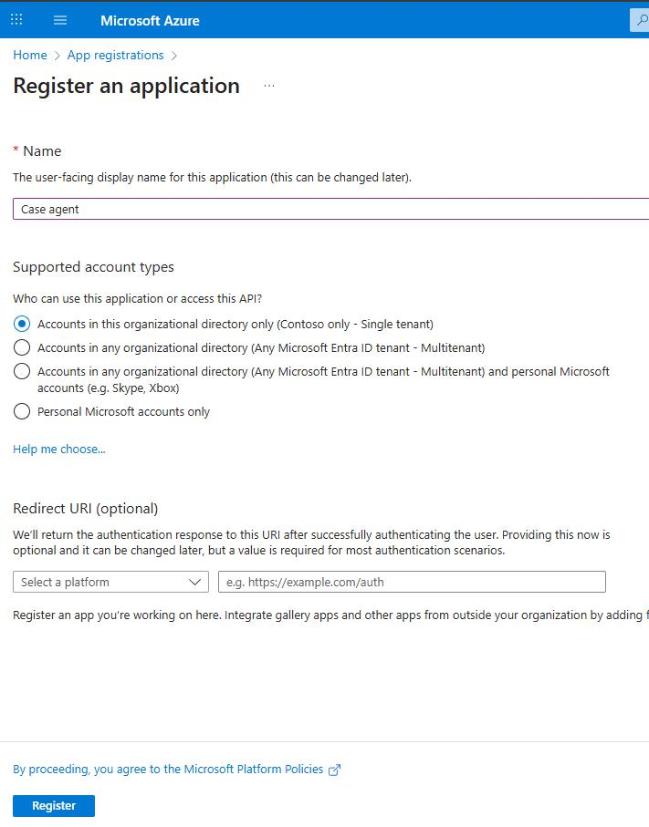

7. Select **Register**.

8. Wait for registration to complete. Then, in the left pane for the registration, expand the **Manage** section and select **Certificates and secrets**.

    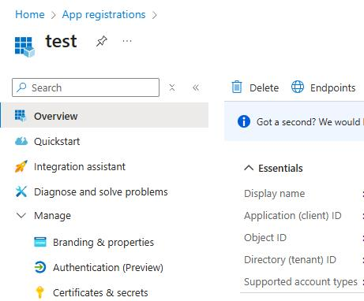

9. Select **New client secret**.

    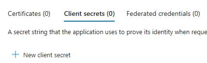

10. In the **Description** field, enter `Used for the case management agent` and then select **Add**.

    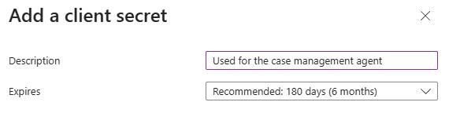

    

### 02: Create an application user

1. Return to the **Power Platform admin center** browser window.

2. In the **Manage** pane, select **Environments**.

    

3. On the **Environments** page, select your demo environment.

4. On the command bar at the top of the page, select **Settings**.

    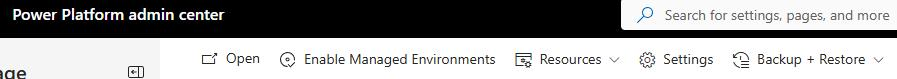

5. Expand **Users + permissions** and then select **Application users**.

    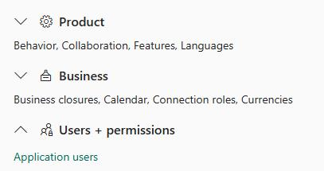

6. Select **+ New app user**.

    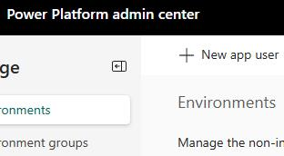

7. On the **Create a new app user** pane, in the **App** section, select **Add an app**.

    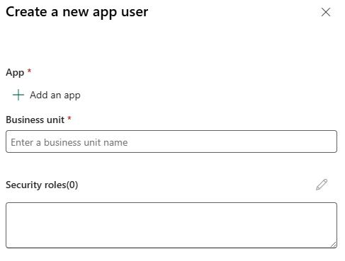

8. Search for and select the `case agent` application user and then select **Add**.

    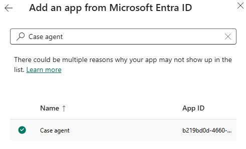

    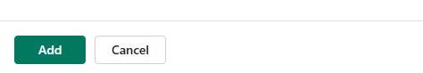

9. In the **Business unit** field, enter `org` to search for business units and then select the existing business unit.

10. In the **Security roles** field, select the pencil icon (**Edit**).

    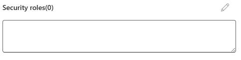

11. Select **Customer Service Representative** and then select **Save**.

12. In the **Role assignment confirmation** dialog, select **Save**.

    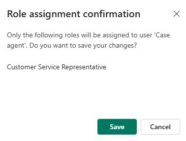

13. In the **Create a new app user** pane, select **Create**.

    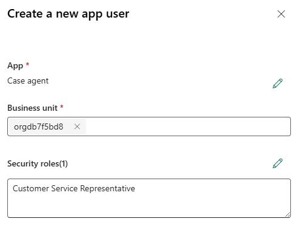

    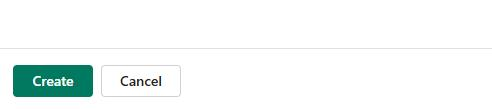

---

## Task 07: Configure and enable a shared mailbox

Next we're going to create a shared mailbox that will be used by the case agent to send email.

### 01: Create the shared mailbox

1. Open a new browser window and go to `admin.microsoft.com`.

2. In the left pane of the Microsoft 365 admin center, select **Teams & groups** and then select **Shared mailboxes**.

    > 
    >   You may need to select **Show all** to see the **Teams & groups** option.

    > 

    

3. On the **Shared mailboxes** page, select **+ Add a shared mailbox**.  

    

4. In the **Name** field, enter `Case Agent`. 

5. Copy the email address that is generated. Paste the email address into the following text field. You'll need the email address later in this task.

6. Select **Save changes**.

    

    

7. Wait for the **Your shared mailbox was created** pane to display. This process can take 1-2 minutes.

    

8. In the **Next steps** section, select **Add members to your shared mailbox**.

9. On the **Shared mailbox member** pane, select **+ Add members**.

    

10. Search for and select your tenant admin email and then select **Add**.

11. Close the **Shared mailbox members** pane.

    

### 02: Enable the shared mailbox

1. Open a web browser and go to `aka.ms/ppac`.

2. Sign in by using your demo admin credentials for the tenant that you created in Exercise 01.

3. In the **Manage** pane, select **Environments**.

    

4. On the **Environments** page, select your demo environment.

5. On the command bar at the top of the page, select **Settings**.

    

6. Expand **Email** and then select **Mailboxes**.

    

7. On the page that opens, at the upper left, select **My Active Mailboxes** and change the value to **All Mailboxes**.

    

8. Locate and select the **# Case agent** mailbox.

    

9. Move down to the **Synchronization Method** section.

    

10. For each of the following settings, change the value to **Server-Side Synchronization**:

    - Incoming Email

    - Outgoing Email

    - Appointments, Contacts, Tasks, and Bookings

11. On the command bar at the top of the page, select **Approve Email**. 

    

12. In the **Approve Primary Email** dialog, select **OK**.

    

13. In the **Unsaved changes** dialog, select **Save and continue**.

    

14. On the command bar at the top of the page, select **Test & Enable Mailbox**. 

    

15. In the **Test Email Configuration** dialog, select **OK**.

    

    > 
    >   You may see an error that resembles the following screenshot. This error message indicates that the application user is not yet available in Dynamics 365.

    >   
    >   

    >   It can take up to 20 minutes for the new application user to show up in your environment. 

    > 

---

## Task 08: Configure auditing

Many of the features that are taking place are doing so automatically. It's important to ensure that the system stores the history of those changes. For this reason, we're going to enable auditing.

1. Open a web browser and go to `aka.ms/ppac`.

2. Sign in by using your demo admin credentials for the tenant that you created in Exercise 01.

3. In the left pane, select **Security** and then select **Compliance**.

    

4. Select the **Auditing** tile. 

    

5. In the **Collect logs with environment auditing** pane, select your tenant and then select **Set up auditing**.

    

6. In the **Auditing** pane, set **Turn on auditing** to **On**.

7. In the **Log these Dataverse events** section, select **User sign-ins** and **Activity**.

8. Select the **Common entities across Dynamics 365** checkbox.

9. In the **Event log retention** field, select **180 days** and then select **Save**.

    

    

---

[← Configure environment settings](03.html){: .btn .mr-2 }
[Import data →](05.html){: .btn .btn-purple }
