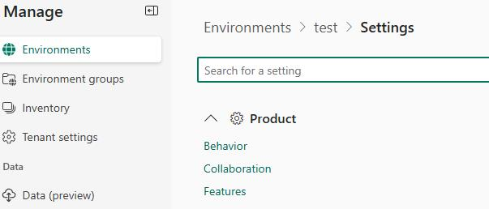
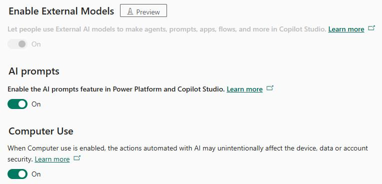

## Task 04: Enable AI prompts

**Estimated time to complete this task**: 

- Hands-on: 3-5 minutes

-  Open a web browser and go to `aka.ms/ppac`.

-  Sign in by using the following credentials:

Admin name: admin@D365DemoTSCE13056416.onmicrosoft.com 

- Password: Use the password for the tenant that you created in Exercise 01.

-  In the **Manage** pane, select **Environments**.

-  On the **Environments** page, select the **D365CES60084966** environment.

-  On the command bar at the top of the page, select **Settings**.

-  Expand **Products** and then select **Features**.

-  Move down the page and locate the **AI prompts** section. 

-  Set the value of the **Enable the AI prompts feature in Power Platform and Copilot Studio** feature to **On**.

> 
>   For recent deployments, the value for this setting may be **On** by default.

> 

-  Select **Save**.

---
