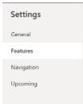

## Task 05: Enable the modern look

For many of the new features to display correctly, you'll need to make sure that you've configured the system to use the new look.

**Estimated time to complete this task**: 

- Hands-on: 3-5 minutes

-  Open a web browser and go to `make.powerapps.com`.

-  Sign in by using the demo tenant administrative credentials:

Admin name: admin@D365DemoTSCE13056416.onmicrosoft.com 

-  On the command bar, select **Environment** and then select the **D365CES60084966** environment.

-  In the left pane, select **Apps**.

-  In the list of solutions, select **Dynamics 365 Sales**.

-  Select **Settings** and then select **Features**.

-  Enable **New look for model-driven apps** and then select **Save**.

-  Publish the app.

> 
>   The **Publish** button appears at the top right on the command bar and looks like a window with an upward facing arrow.

> 

## 

