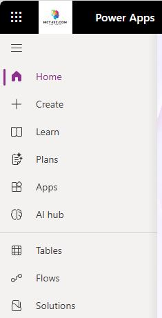
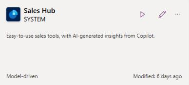
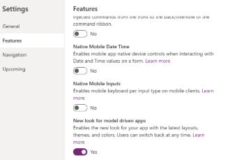

## Task 05: Enable the modern look

For many of the new features to display correctly, you'll need to make sure that you've configured the system to use the new look.

**Estimated time to complete this task**: 

- Hands-on: 3-5 minutes

1. Open a web browser and go to `make.powerapps.com`.

2. Sign in by using the demo tenant administrative credentials:

    Admin name: `admin@<YourTenantName>.onmicrosoft.com` 

3. On the command bar, select **Environment** and then select your demo environment.

4. In the left pane, select **Apps**.

    

5. In the list of apps, select **Sales Hub**.

    

6. Select **Settings** and then select **Features**.

    

7. Enable **New look for model-driven apps** and then select **Save**.

    

8. Publish the app.

    > 
    >   The **Publish** button appears at the top right on the command bar and looks like a window with an upward facing arrow.

    > 

## 

---

[← Task 04](04.md){: .btn .mr-2 }
[Task 06 →](06.md){: .btn .btn-purple }
