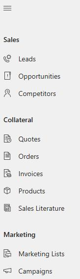
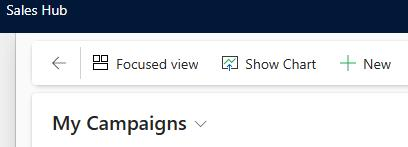
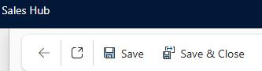
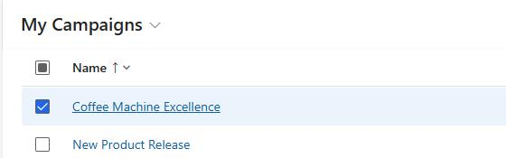
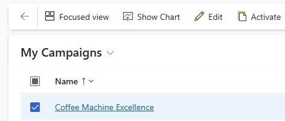
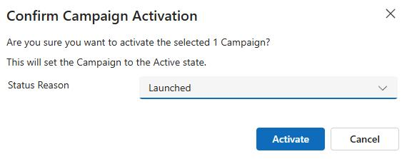
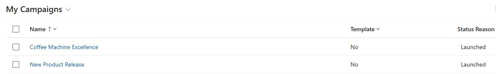
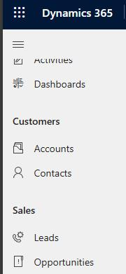
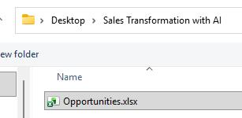
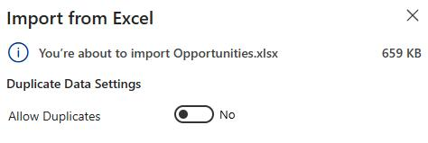

# Import data

In this section, you'll import product data, create marketing campaigns, import opportunity records, and create goals.

---

## Task 09: Create product data

1. Open a web browser and go to `<D365CESDeploymentURL>`.

2. Select the **Sales Hub** tile.

    

3. In the left pane, in the **Collateral** section, select **Products**.

    

4. On the command bar, select the vertical ellipses. Select **Import from Excel** and then select **Import from CSV**.   

    

5. In the **Import from CSV** pane, select **Choose File**. 

6. In File Explorer, go to the folder where you downloaded file from GitHub and open the **Sales Transformation with AI** folder.

    

7. Select **Products.csv** and then select **Open**.

8. In the **Import from CSV** pane, select **Next**.

9. Set **Allow Duplicates** to **No** and then select **Review Mapping**.       

    

    

10. Select **Finish Import**.

11. In the **Submit Data** dialog, select **Confirm**.

    

12. In the **Import from CSV** pane, select **Done**.

---

## Task 10: Create marketing campaigns

1. Open a web browser and go to `<D365CESDeploymentURL>`.

2. In the left pane, in the **Marketing** section, select **Campaigns**.

    

3. On the command bar, select **+ New**.

    

4. In the **Name** field, enter `Coffee Machine Excellence`.

5. In the **Campaign type** field, select **Advertisement**.

6. Select **Save**. On the command bar, select **Save & Close**.

    

7. Repeat steps 3-6 to create the following 11 marketing campaigns. Use the names and types from the table below to create the campaigns.

    | Campaign name | Campaign type |
    | --- | --- |
    | `Loyalty Customer Promotion` | `Direct Marketing` |
    | `New Product Release` | `Direct Marketing` |
    | `Perfect Brew Coffee Webinar` | `Co-branding` |
    | `Intelligent Coffee Machine Showcase` | `Co-branding` |
    | `Barista Monthly Digest` | `Direct Marketing` |
    | `Coffee Innovation Webinar` | `Event` |
    | `Customer Care Campaign` | `Other` |
    | `Customer Follow-up` | `Other` |
    | `Coffee Trade Fair` | `Event` |
    | `Global Coffee Expo` | `Event` |
    | `Sustainable Coffee Newsletter` | `Direct Marketing` |

8. Verify that all 12 marketing campaigns display.

    

9. Select all campaigns. Then, on the command bar, select **Activate**.

    

10. In the **Confirm Campaign Activation** dialog, change the **Status Reason** to **Launched** and then select **Activate**.

    

11. Review the list of campaigns and ensure that the **Status Reason** is set to **Launched** for all campaigns.

    

---

## Task 11: Import opportunity records

The Opportunities.xlsx file includes 5,000 entries. The data covers the last five years and includes some estimated revenue for 2026. All attributes are curated, and data is populated for the Sales Research Agent demo. In this task, you'll import the opportunities records.

{: .note }
> - It takes approximately 3.5 hours to import the 5,000 records.
> - It's recommended that you import the records when the environment is not being used by other users or for any other activities.
> - During the import process, internet session disconnects may occur if the connection is not secure or stable, potentially causing some records to fail to import.

1. Open a web browser and go to `<D365CESDeploymentURL>`.

2. In the left pane, in the **Sales** section, select **Opportunities**.

    

3. On the command bar, select the vertical ellipses (three dots) and then select **Import from Excel**.

    

4. In the **Import from Excel** pane, select **Choose File**. 

5. In File Explorer, go to the folder where you downloaded file from GitHub and open the **Sales Transformation with AI** folder.

6. Select **Opportunities.xlsx** and then select **Open**.

    

7. In the **Import from Excel** pane, select **Next**.

8. Set **Allow Duplicates** to **No** and then select **Finish Import**.       

    

    

9. In the **Import from Excel** pane, select **Done**.

    

### Monitor the import process

1. On the command bar, select **Settings** (the gear icon) and then select **Advanced Settings**.

    

2. In the left pane, in the **System** section, select **Data management**.

    

3. On the **Data Management** page, select **Imports**.

    

4. On the **My Imports** page, review the record for the **Opportunites.xlsx** file.

    

    > 
    >   The **Status Reason** column will display **Completed** when the system finishes importing records.

    > 

---

## Task 12: Create and define goals

The Sales Research Agent (SRA) uses Goals (target) data to measure the sales performance of the sales team and the sellers. The data covers the last five years of sales transactions, with goals set by quarter and by year, starting from Quarter 2 2021 to Quarter 4 2025. 

The structure of the Goal records is hierarchical. The parent goal is assigned to the Sales Team, while the child goals are assigned to individual sellers. Each goal record includes four quarters for the years 2021 to 2025.

In this task, you'll create goals.

### Import goal records

1. On the **Dynamics 365 Sales Hub** page, on the command bar, select **Settings** (the gear icon) and then select **Advanced Settings**.

    

2. In the left pane, in the **System** section, select **Data management**.

    

3. On the **Data Management** page, select **Imports**.

    

4. On the command bar, select **+ Import data**.

    

5. In the **Import data into Microsoft Dynamics 365** pane, select **Choose file**. 

6. In File Explorer, go to the folder where you downloaded file from GitHub and open the **Sales Transformation with AI** folder.

7. Select **Goals.xlsx** and then select **Open**.

8. Select **Next** twice.

9. In the **Map record types** pane, wait while the system analyzes the uploaded records.

    > 
    >   The system should automatically identify the records as goals and map all fields.

    > 

10. Verify the mapping information and then select **Next**.

    

11. Select **Finish**.

    

### Monitor the import process

1. On the command bar, select **Settings** (the gear icon) and then select **Advanced Settings**.

    

2. In the left pane, in the **System** section, select **Data management**.

    

3. On the **Data Management** page, select **Imports**.

    

4. On the **My Imports** page, review the record for the **Goals.xlsx** file.

    

---

[← Configure app registration and email](04.html){: .btn .mr-2 }
[Summary →](06.html){: .btn .btn-purple }
