## Task 07: Configure and enable a shared mailbox

Next we're going to create a shared mailbox that will be used by the case agent

to send email. 

**Estimated time to complete this task**: 

- Hands-on: 5-10 minutes

### 01: Create the shared mailbox

1. Open a new browser window and go to `admin.microsoft.com`.

2. In the left pane of the Microsoft 365 admin center, select **Teams & groups** and then select **Shared mailboxes**.

    > 
    >   You may need to select **Show all** to see the **Teams & groups** option.

    > 

    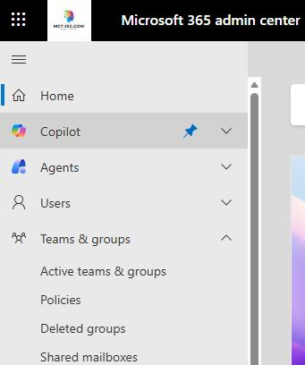

3. On the **Shared mailboxes** page, select **+ Add a shared mailbox**.  

    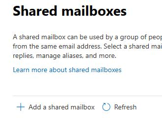

4.    In the **Name** field, enter `Case Agent`. 

5. Copy the email address that is generated. Paste the email address into the following text field. You'll need the email address later in this task.

6. Select **Save changes**.

    

    

7. Wait for the **Your shared mailbox was created** pane to display. This process can take 1-2 minutes.

    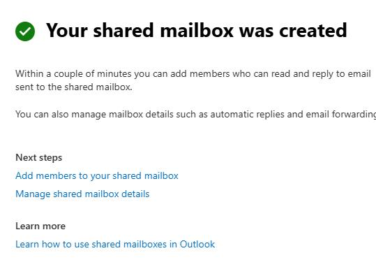

8. In the **Next steps** section, select **Add members to your shared mailbox**.

9. On the **Shared mailbox member** pane, select **+ Add members**.

    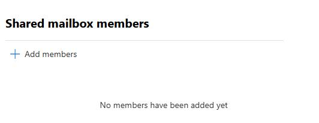

10. Search for and select your tenant admin email and then select **Add**.

11. Close the **Shared mailbox members** pane.

    

### 02: Enable the shared mailbox

1. Open a web browser and go to `aka.ms/ppac`.

2. Sign in by using your demo admin credentials for the tenant that you created in Exercise 01.

3. In the **Manage** pane, select **Environments**.

    

4. On the **Environments** page, select your demo environment.

5. On the command bar at the top of the page, select **Settings**.

    

6. Expand **Email** and then select **Mailboxes**.

    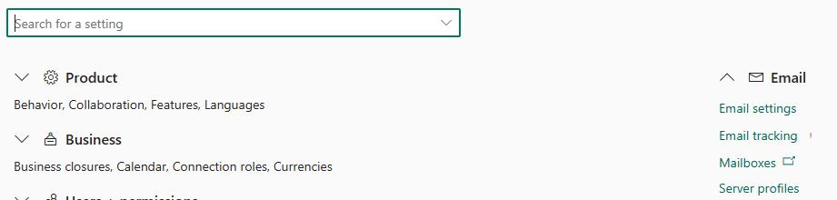

7. On the page that opens, at the upper left, select **My Active Mailboxes** and change the value to **All Mailboxes**.

    

8. Locate and select the **# Case agent** mailbox.

    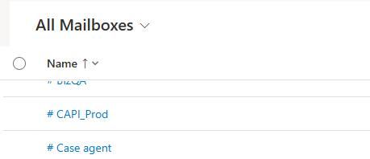

9. Move down to the **Synchronization Method** section.

    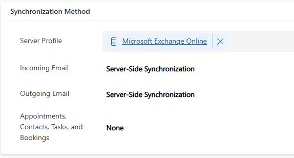

10. For each of the following settings, change the value to **Server-Side Synchronization**:

    - Incoming Email

    - Outgoing Email

    - Appointments, Contacts, Tasks, and Bookings

11. On the command bar at the top of the page, select **Approve Email**. 

    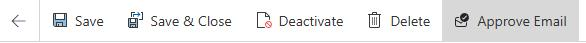

12. In the **Approve Primary Email** dialog, select **OK**.

    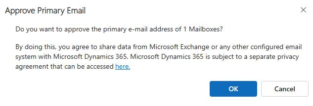

13. In the **Unsaved changes** dialog, select **Save and continue**.

    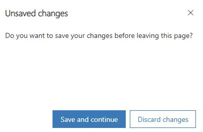

14. On the command bar at the top of the page, select **Test & Enable Mailbox**. 

    

15. In the **Test Email Configuration** dialog, select **OK**.

    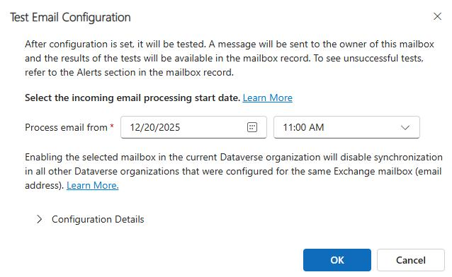

    > 
    >   You may see an error that resembles the following screenshot. This error message indicates that the application user is not yet available in Dynamics 365.

    >   
    >   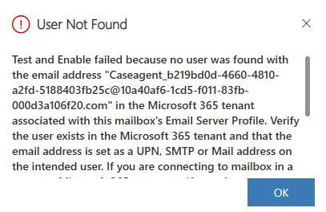

    >   It can take up to 20 minutes for the new application user to show up in your environment. 

    > 

---
