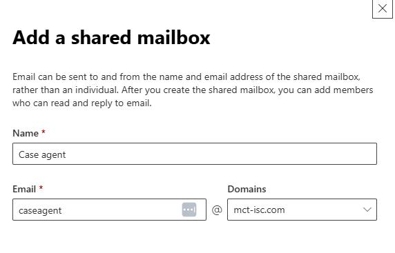
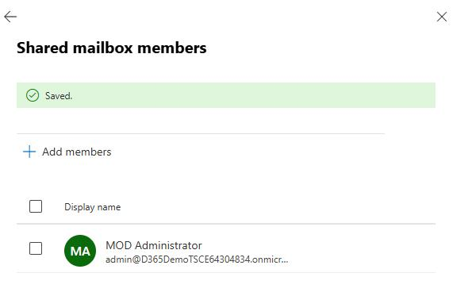
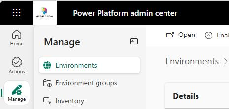
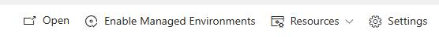
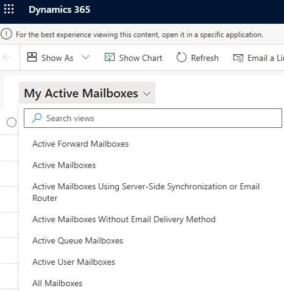
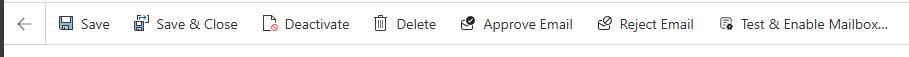

## Task 07: Configure and enable a shared mailbox

Next we're going to create a shared mailbox that will be used by the case agent

to send email. 

**Estimated time to complete this task**: 

- Hands-on: 5-10 minutes

### 01: Create the shared mailbox

-  Open a new browser window and go to `admin.microsoft.com`.

-  In the left pane of the Microsoft 365 admin center, select **Teams & groups** and then select **Shared mailboxes**.

> 
>   You may need to select **Show all** to see the **Teams & groups** option.

> 

-  On the **Shared mailboxes** page, select **+ Add a shared mailbox**.  

-     In the **Name** field, enter `Case Agent`. 

-  Copy the email address that is generated. Paste the email address into the following text field. You'll need the email address later in this task.

-  Select **Save changes**.

-  Wait for the **Your shared mailbox was created** pane to display. This process can take 1-2 minutes.

-  In the **Next steps** section, select **Add members to your shared mailbox**.

-  On the **Shared mailbox member** pane, select **+ Add members**.

-  Search for and select **admin@D365DemoTSCE13056416.onmicrosoft.com** and then select **Add**.

-  Close the **Shared mailbox members** pane.

### 02: Enable the shared mailbox

-  Open a web browser and go to `aka.ms/ppac`.

-  Sign in by using the following credentials:

Admin name: admin@D365DemoTSCE13056416.onmicrosoft.com 

- Password: Use the password for the tenant that you created in Exercise 01.

-  In the **Manage** pane, select **Environments**.

-  On the **Environments** page, select the **D365CES60084966** environment.

-  On the command bar at the top of the page, select **Settings**.

-  Expand **Email** and then select **Mailboxes**.

-  On the page that opens, at the upper left, select **My Active Mailboxes** and change the value to **All Mailboxes**.

-  Locate and select the **# Case agent** mailbox.

-  Move down to the **Synchronization Method** section.

-  For each of the following settings, change the value to **Server-Side Synchronization**:

Incoming Email

- Outgoing Email

- Appointments, Contacts, Tasks, and Bookings

-  On the command bar at the top of the page, select **Approve Email**. 

-  In the **Approve Primary Email** dialog, select **OK**.

-  In the **Unsaved changes** dialog, select **Save and continue**.

-  On the command bar at the top of the page, select **Test & Enable Mailbox**. 

-  In the **Test Email Configuration** dialog, select **OK**.

> 
>   You may see an error that resembles the following screenshot. This error message indicates that the application user is not yet available in Dynamics 365.

>   
>   

>   It can take up to 20 minutes for the new application user to show up in your environment. 

> 

---
