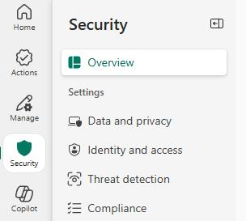
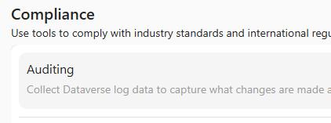
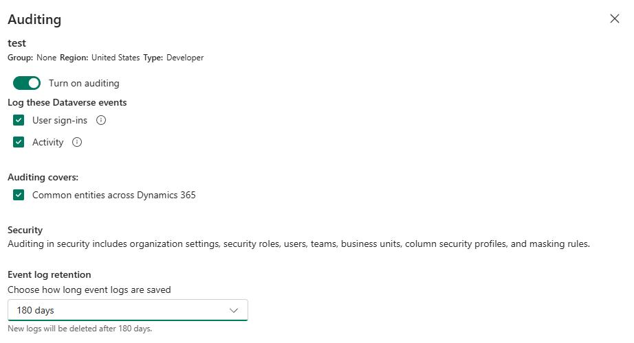

## Task 08: Configure auditing

Many of the features that are taking place are doing so automatically.  It's important to ensure that the system stores the history of those changes. For this reason, we're going to enable auditing.

**Estimated time to complete this task**: 

- Hands-on: 3-5 minutes

1. Open a web browser and go to `aka.ms/ppac`.

2. Sign in by using your demo admin credentials for the tenant that you created in Exercise 01.

3. In the left pane, select **Security** and then select **Compliance**.

    

4. Select the **Auditing** tile. 

    

5. In the **Collect logs with environment auditing** pane, select your tenant and then select **Set up auditing**.

    

6. In the **Auditing** pane, set **Turn on auditing** to **On**.

7. In the **Log these Dataverse events** section, select **User sign-ins** and **Activity**.

8. Select the **Common entities across Dynamics 365** checkbox.

9. In the **Event log retention** field, select **180 days** and then select **Save**.

    

    

---
