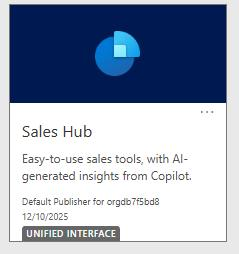
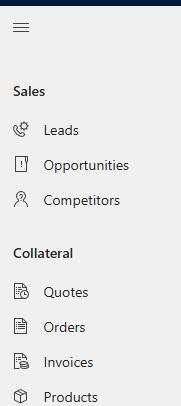
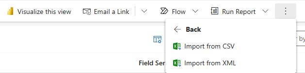
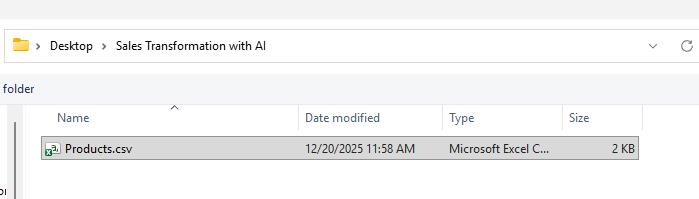
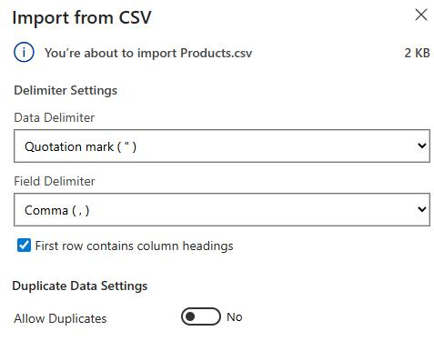
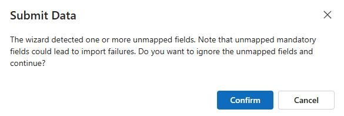

## Task 09: Create product data

-  Open a web browser and go to `<D365CESDeploymentURL>`.

-  Select the **Sales Hub** tile.

-  In the left pane, in the **Collateral** section, select **Products**.

-  On the command bar, select the vertical ellipses. Select **Import from Excel** and then select **Import from CSV**.   

-  In the **Import from CSV** pane, select **Choose File**. 

-  In File Explorer, go to the folder where you downloaded file from GitHub and open the **Sales Transformation with AI** folder.

-  Select **Products.csv** and then select **Open**.

-  In the **Import from CSV** pane, select **Next**.

-  Set **Allow Duplicates** to **No** and then select **Review Mapping**.       

-  Select **Finish Import**.

-  In the **Submit Data** dialog, select **Confirm**.

-  In the **Import from CSV** pane, select **Done**.

---
