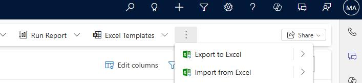
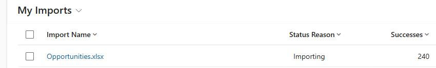

## Task 11: Import opportunity records

The Opportunities.xlsx file includes 5,000 entries. The data covers the last five years and includes some estimated revenue for 2026. All attributes are curated, and data is populated for the Sales Research Agent demo. In this task, you'll import the opportunities records.

**Estimated time to complete this task**: 

- Hands-on: 3-5 minutes

- Processing time: 3- 5 hours

> 
>   
> 
>   - It takes approximately 3.5 hours to import the 5,000 records.
> 
>   - It's recommended that you import the records when the environment is not being used by other users or for any other activities.
> 
>   - During the import process, internet session disconnects may occur if the connection is not secure or stable, potentially causing some records to fail to import. 
> 
>   
> 
> 

-  Open a web browser and go to `<D365CESDeploymentURL>`.

-  In the left pane, in the **Sales** section, select **Opportunities**.

-  On the command bar, select the vertical ellipses (three dots) and then select **Import from Excel**.

-  In the **Import from Excel** pane, select **Choose File**. 

-  In File Explorer, go to the folder where you downloaded file from GitHub and open the **Sales Transformation with AI** folder.

-  Select **Opportunities.xlsx** and then select **Open**.

-  In the **Import from Excel** pane, select **Next**.

-  Set **Allow Duplicates** to **No** and then select **Finish Import**.       

-  In the **Import from Excel** pane, select **Done**.

### 02: Monitor the import process

-  On the command bar, select **Settings** (the gear icon) and then select **Advanced Settings**.

-  In the left pane, in the **System** section, select **Data management**.

-  On the **Data Management** page, select **Imports**.

-  On the **My Imports** page, review the record for the **Opportunites.xlsx** file.

> 
>   The **Status Reason** column will display **Completed** when the system finishes importing records.

> 

---
