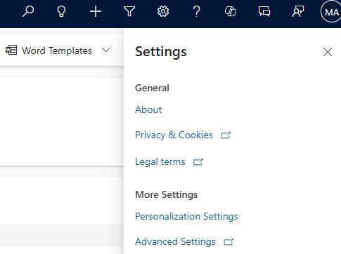
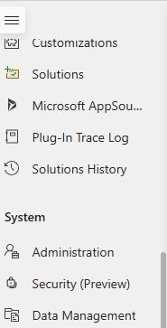
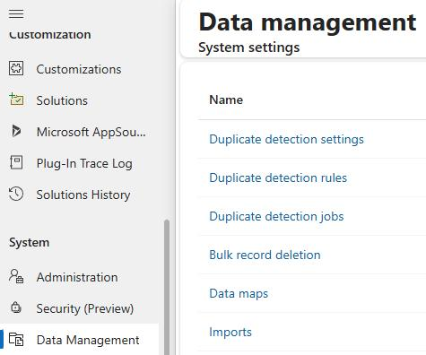
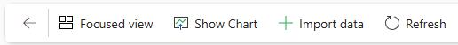
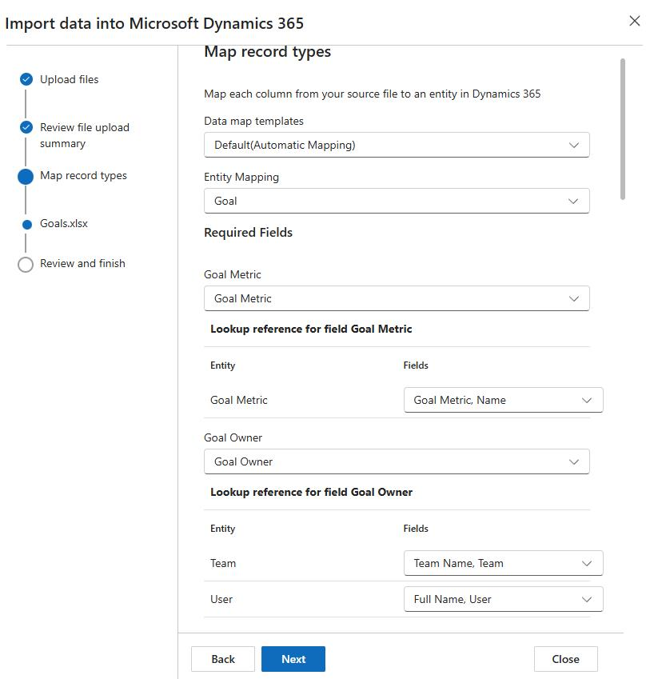
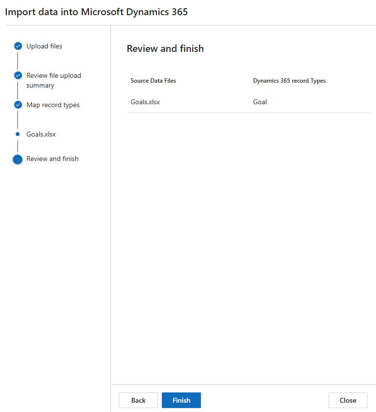
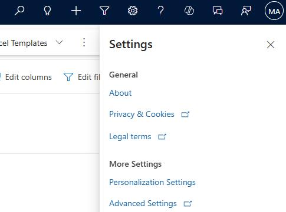
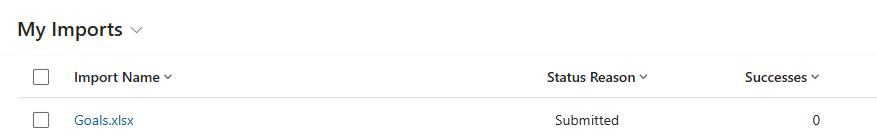

## Task 12: Create and define goals

The Sales Research Agent (SRA) uses Goals (target) data to measure the sales performance of the sales team and the sellers. The data covers the last five years of sales transactions, with goals set by quarter and by year, starting from Quarter 2 2021 to Quarter 4 2025. 

The structure of the Goal records is hierarchical. The parent goal is assigned to the Sales Team, while the child goals are assigned to individual sellers. Each goal record includes four quarters for the years 2021 to 2025.

In this task, you'll create goals.

**Estimated time to complete this task**: 

- Hands-on: 3-5 minutes

- Processing time: 15-20 minutes

### 01: Import goal records

-  On the **Dynamics 365 Sales Hub** page, on the command bar, select **Settings** (the gear icon) and then select **Advanced Settings**.

-  Select **Validate my information**. This step is required before you can proceed.

-  In the left pane, in the **System** section, select **Data management**.

-  On the **Data Management** page, select **Imports**.

-  On the command bar, select **+ Import data**.

-  In the **Import data into Microsoft Dynamics 365** pane, select **Choose file**. 

-  In File Explorer, go to the folder where you downloaded file from GitHub and open the **Sales Transformation with AI** folder.

-  Select **Goals.xlsx** and then select **Open**.

-  Select **Next** twice.

-  In the **Map record types** pane, wait while the system analyzes the uploaded records.

> 
>   The system should automatically identify the records as goals and map all fields.

> 

-  Verify the mapping information and then select **Next**.

-  Select **Finish**.

### 02: Monitor the import process

-  On the command bar, select **Settings** (the gear icon) and then select **Advanced Settings**.

-  In the left pane, in the **System** section, select **Data management**.

-  On the **Data Management** page, select **Imports**.

-  On the **My Imports** page, review the record for the **Goals.xlsx** file.

---
