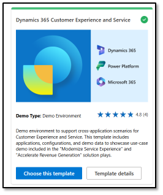

# Deploy your environment

You've selected the **Service Transformation with AI** workshop. In this task, you'll deploy the Demo Hub solution template to provision an environment.

> 
>   It is highly recommended that you deploy the latest version of the Demo Hub Template. Older versions might be missing some items and may not allow some of the Teams calling features to be deployed. While you may be able to complete all the labs without a fresh deployment, it is not guaranteed.

> 

## Task 01: Import the Demo Hub solution template

1. Go to [DemoHub](https://bizappsdemos.microsoft.com/).

2. In DemoHub, deploy the **Dynamics 365 Customer Experience and Service** demo template.

    

---
