# Configure users and licenses

When cases are imported into the application, they are assigned to different users. In this section, you'll identify the user accounts in your environment, configure them, and add any that are missing.

---

## Task 02: Identify the user accounts in your environment

Your demo tenant users may be different from the ones listed (For example, you have Amy Adams instead of Amy Alberts, or a different name for Anita Montero, Benjamin Mcphee or any other user.

### 01: Identify which user accounts are present

1. In Edge, go to `Https://admin.microsoft.com`. Sign in by using the administrator credentials for your demo enviornment.

2. In the left pane, expand **Users** and select **Active Users**.

    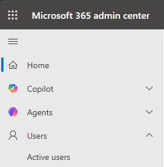

3. Identify whether you have the following user accounts created in your demo environment: 

    

    Alan Steiner

    - Alex Baker

    - Alica Thomber

    - Amy Alberts

    - Anita Montero

    - Benjamin Mcphee

    - David Mallory

    - Molly Clark

    - Nancy Warner

    - Renee Lo

    - Spencer Low

---

### 02: Check the configuration for existing user accounts

> 
>   Repeat this set of steps to configure each existing user account.

> 

1. Select a user account.

    

2. At the top of the user details pane, select **Reset password**.

    

3. On the **Reset password** pane, clear both checkboxes.

4. In the **Password** field, enter `DemoEnvPa55w.rd` and then select **Reset password**.

    

    

    > 
    >   You will use this password any time you need to sign in as one of the listed users.

    > 

5. On the **Password has been reset** pane, select **Close**.

6. Select the user account again.

    

7. On the command bar for the user details pane, select **Licenses and apps**.

8. Ensure that the following licenses are assigned. Add any missing licenses and then select **Save changes**.

    Microsoft 365 E5 (No Teams)

    - Microsoft Teams Enterprise

    - Dynamics 365 and Power Platform multi-app demo

    

---

### 03: Add missing user accounts

> 
>   Repeat this set of steps to add each missing user account.

> 

1. If necessary, select **Users** and then select **Active Users**.

2. Select **Add a user**.

3. Enter values for the **First name**, **Last name**, and **Username** fields.

4. Clear **Automatically create a password**.

5. Enter a **password**. Clear **Require the user to change password**.

6. Select **Next**.

7. Assign the Following licenses:

    Microsoft 365 E5 (No Teams)

    - Microsoft Teams Enterprise

    - Dynamics 365 and Power Platform multi-app demo

    - Select **Next**.

    - Select **Finish**.

---

## Task 03: Ensure that your users are added to the correct Power Platform environment

As part of the data import process, we are going to be we are going to be adding a lot of cases to your environment.  To provide the most realistic demo experience, it is important that your cases are assigned to different users.  For this reason, we need to make sure that the users we mentioned above are added as users in your tenant.

### 01: Identify which user accounts are present

1. Open a new browser tab and go to `https://admin.powerplatform.microsoft.com/`. 

    - In the left pane, select **Manage** and then select **Environments**.

    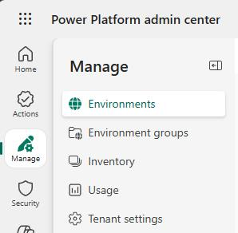

2. Select the Demo environment that you will be using.

    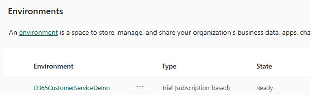

3. Select **Settings**.

    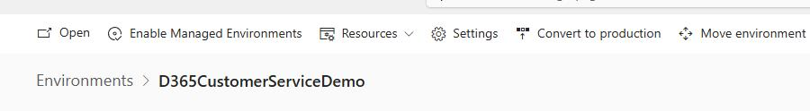

4. Expand **Users and permissions** and then select **Users**.

    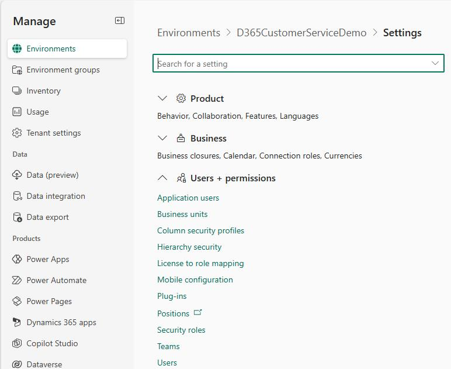

5. Identify whether the following user accounts are associated with your Power Platform environment: 

    > 
    >   In the Microsoft 365 admin center, each email address includes an 8-digit identifier. In the table below, we use the "xxxxxxxx" placeholder. When you add users, be sure to use the 8-digits for your demo tenant.

    > 

    Alan Steiner 

    - Alex Baker 

    - Alica Thomber 

    - Amy Alberts 

    - Anita Montero 

    - Benjamin Mcphee 

    - David Mallory 

    - Molly Clark 

    - Nancy Warner 

    - Renee Lo 

    - Spencer Low 

---

### 02: Check the configuration for existing user accounts

> 
>   Repeat this set of steps to configure each existing user account.

> 

1. Select a user account.

    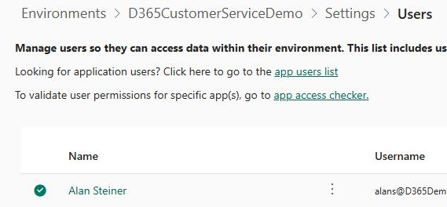

2. On the user details pane, in the **Direct Assigned Roles** section, select **Manage roles**.

    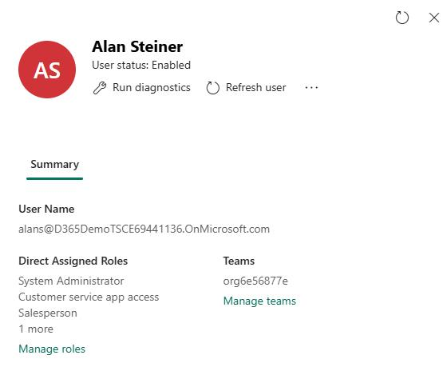

3. In the list of security roles, ensure that the following roles are assigned to the user. Assign any missing roles:

    > 
    >   Each time you select a role, the pane refreshes and you may be moved to a spot earlier or later in the list. Check your work!

    > 

    **Customer Service App Access**

    - **Customer Service Representative**    

    - **System Administrator**

    - **Workforce Management application access**

---

### 03: Add missing user accounts

> 
>   Repeat this set of steps to add each missing user account.

> 

1. On the **Users** page, on the command bar, select **Add user**.

    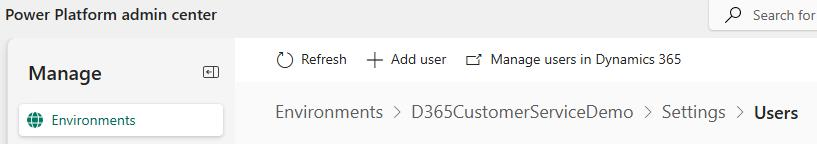

2. Enter the name for the user that you want to add and then select the user from the list of users that displays.

    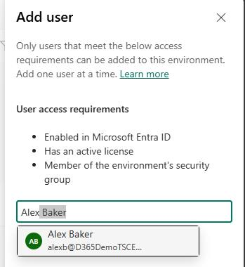

3. Select **Add**.

4. In the list of security roles, assign each user the following roles:

    > 
    >   Each time you select a role, the pane refreshes and you may be moved to a spot earlier or later in the list. Check your work!

    > 

    **Customer Service App Access**

    - **Customer Service Representative**    

    - **System Administrator**

    - **Workforce Management application access**

    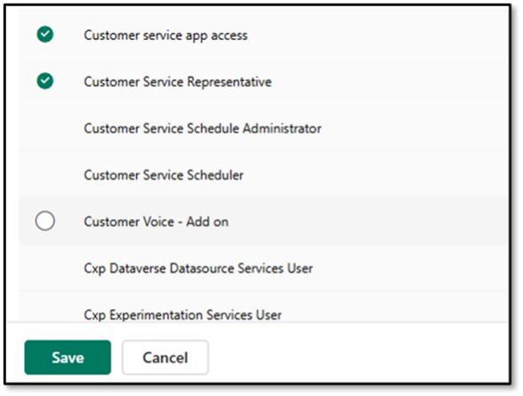

    - Select **Save**.

5. On the confirmation dialog that displays, check to ensure that the correct roles are assigned and then select **Save**.

    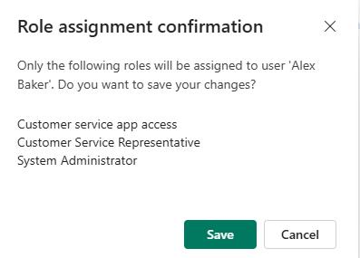

---
