# Configure forecast external data

In this section, you'll enable Workforce Management, create bookable resources and shift activity types, import forecast data, and configure short-term and long-term forecast scenarios.

---

## Task 04: Enable Workforce Management

1. Open a web browser and go to `https://admin.powerplatform.microsoft.com`.

    - Sign in using your administrator credentials.

2. In the left pane, select **Manage**.

    

3. In the **Manage** pane, in the **Products** section, select **Dynamics 365 Apps**.

    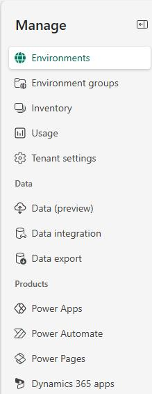

4. Locate the **Workforce Management for Customer Service** app.

    

5. Select the ellipsis (**…**) and then select **Install**.

    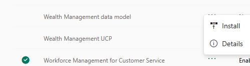

6. In the **Install Workforce Managermet for Customer Service** pane, select your environment.

    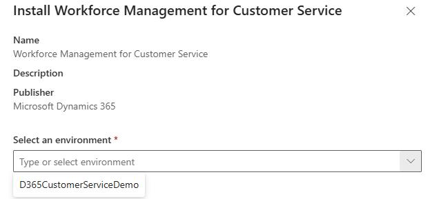

7. Select **I agree to the terms of service** and then select **Install**.

    

    > 
    >   It can take up to an hour for workforce management to install in your environment. You can continue on with the tasks in this exercise while installation is in process.

    > 

---

## Task 05: Create bookable resources

For service representatives to be scheduled for activities, you must create a bookable resource entity for each representative.

1. In Edge, go to your Dynamics 365 environment. The URL should resemble `https://<YourOrgID>.crm.dynamics.com/`.

2. If prompted, sign in by using the administrator credentials for your demo enviornment.

3. On the **Published Apps** page, select **Copilot Service admin center**.

    

4. In the left pane, In the **Operations** section, select **Workforce management**.

    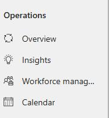

5. On the **Workforce management** page, in the **Workforce setup** section, select **View**.

    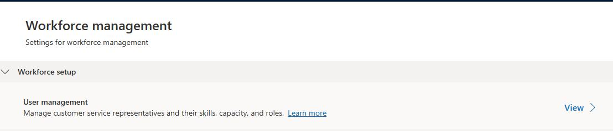

6. In the **Users** section, select **Manage**.

    

7. In the **Enabled Users** list, search for and select your administrative user account.

    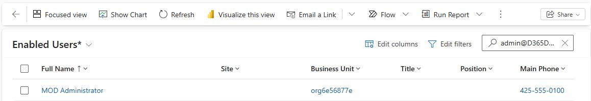

8. On the user page, on the command bar, select **Omnichannel**.

    

9. On the **Skills Configuration** tile, select the vertical ellipses (**…**) and then select **+ New Bookable Resource**.

    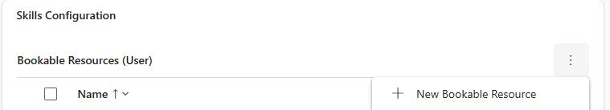

10. Enter the following details:

    Resource Type: **User**

    - Name: Your admin user 

    - User: Set to your user account

    - Time zone: Select your time zone 

    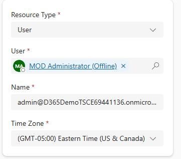

11. On the command bar, select **Save and Close**.

    

12. On the **Skills Configuration** tile, select the bookable resource record you just created.

    

13. On the command bar for the resource, select **Work hours**.

    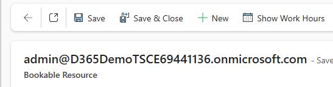

14. Select one event on the calendar. Select **Delete** and then select **Aall events in the series**. Then, in the confirmation dialog, select **Delete**.

    > 
    >   This step deletes all working hours for the user.

    > 

    

15. On the command bar for the calendar, select **+ New** and then select **Workhing hours**.

    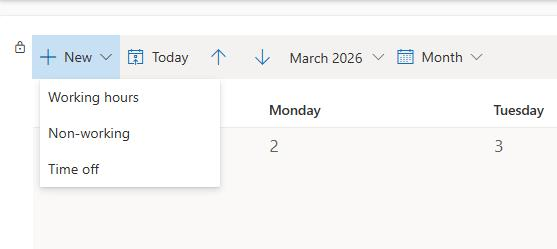

16. Configure the working hours by using the following information and then select **Save**:

    **Repeat**: Every Week

    - **Days:** Monday - Friday

    - **Start time:** 8:00 AM

    - **End time:** 5:00 PM

    - **Time Zone:** Set to your timezone.

    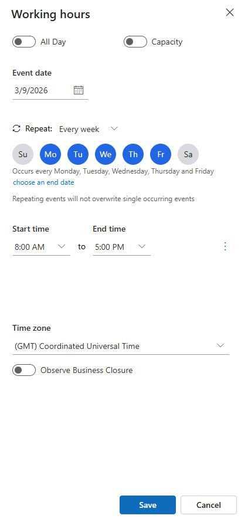

17. Repeat Steps 7 through 11 to create bookable resource records and define working hours for the following users:

    Alan Steiner

    - Alex Baker

    - Alica Thomber

    - Amy Alberts

    - Anita Montero

    - Benjamin Mcphee

    - David Mallory

    - Molly Clark

    - Nancy Warner

    - Renee Lo

    - Spencer Low

---

## Task 06: Create shift activity types

1. Open the Copilot Service admin center app.

2. In the left pane, select **Workforce management**. Locate the **Shift and schedule management** section.

3. Select **Shift and schedule** management, in the **Shift activity Types** section, select **Manage**.

    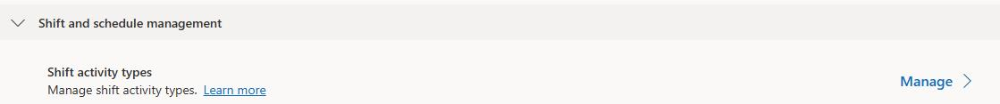

4. On the command bar, select **+ New**.

    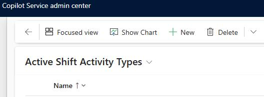

5. Configure the **Shift activity** type as follows:

    **Name:** `Break`

    - **Description:** `Break Time`

    - **Automatic Assignment Status:** Assignable

    - **Duration:** **30 minutes**

    - **Color:** `#c890f5`

    - **Dark theme Color:** `#c890f5`

    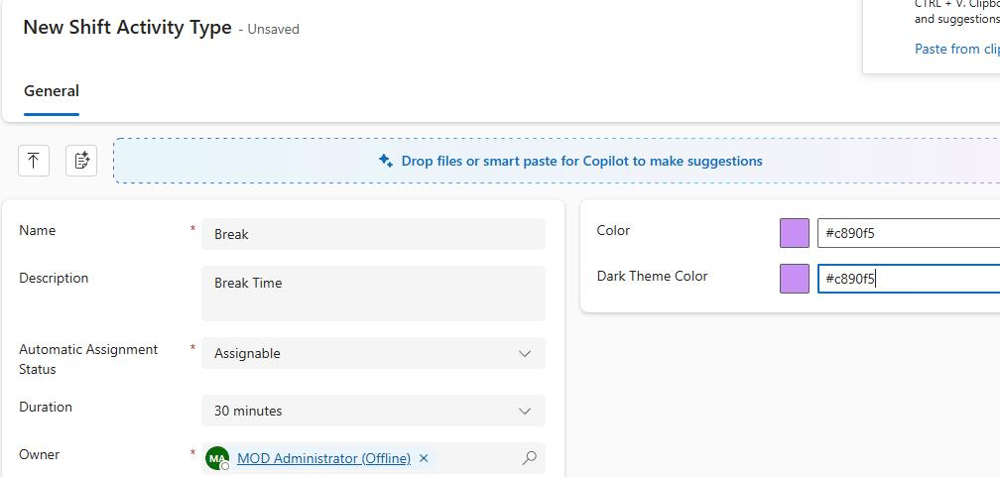

6. On the command bar, select **Save and Close**.

    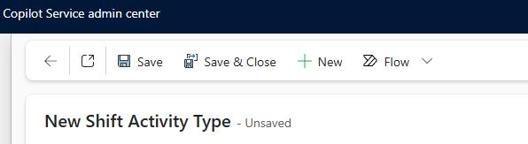

7. Repeat Steps 4 through 6 to create the following shift activity types:

    | Name | Description | Duration | Color | Dark Color |

    | Chat Customer Support | Provide support through Chat | 1 Hr 30 Mins | #90bcfs | #90bcfs |

    | Email Customer Support | Providing Support through Email | 1 Hr 30 Mins | #f1f590 | #f1f590 |

    | Training | Training Sessions | 30 Mins | #f57398 | #f57398 |

    | Voice Customer Support | Provide Support via Voice | 1 Hr 30 Mins | #f5da90 | #f5da90 |

---

## Task 07: Import daily and intraday external data

> 
>   BEFORE YOU BEGIN: The two files that you will be importing include information based on dates. DO NOT open the files in excel before importing.  It will change the dates and impact on the way your demo will work.

> 

---

### 01: Import intraday data

1. Extract the files from the zip file that was included in your class materials.

2. At the top of the page, select **Copilot Service admin center**. This displays a list of apps.

    

3. In the list of apps, select **Copilot Service workspace**.

    

4. In the left pane, in the **Workforce management** section, select **Forecast External Data**.

    > 
    >   At the top left of the page, you may need to select the three parallel lines to see the left pane.

    >   
    >   

    > 

    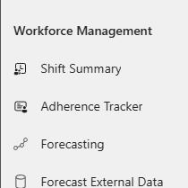

5. On the command bar, select **+ New**.

    

6. In the **Name** field, enter `Contoso Intraday`.

7. In the **File data interval** field, select **Intraday**.

    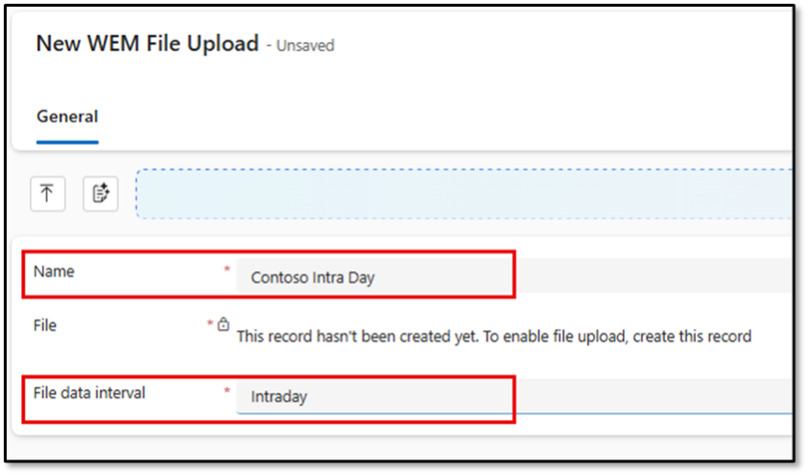

8. On the command bar, select **Save**.  

    > 
    >   You will not be able to upload a file until you save the record.

    > 

    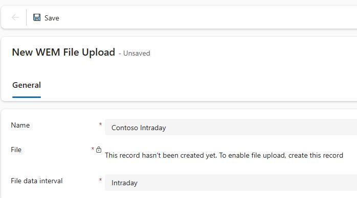

9. Select **Choose File**.

    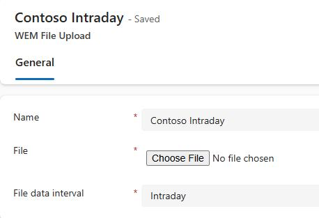

10. Go to the folder that you downloaded and extracted in Exercise 01, Task 2. In the **Service Transformation with AI** subfolder, select **intraday data-20250911** and then select **Open**.

11. On the command bar, select **Save**. 

    > 
    >   You will not receive any confirmation that the file was saved. 

    > 

12. Close the **Contoso Intraday** tab. 

    

13. On the command bar, select **Home**.

    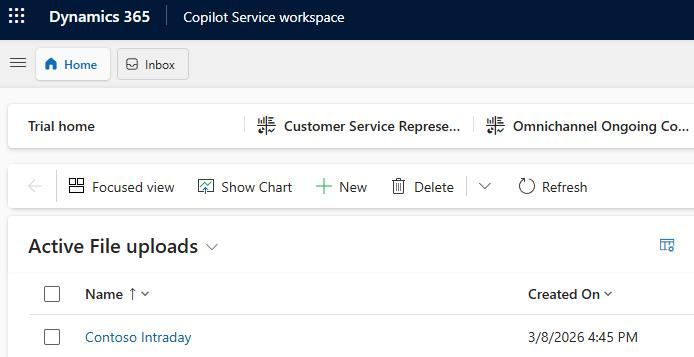

---

### 02: Import daily data

1. On the command bar, select **+ New**.

2. In the **Name** field, enter `Contoso Daily`.

3. In the **File data interval** field, select **Daily**.

    

4. On the command bar select **Save**.

    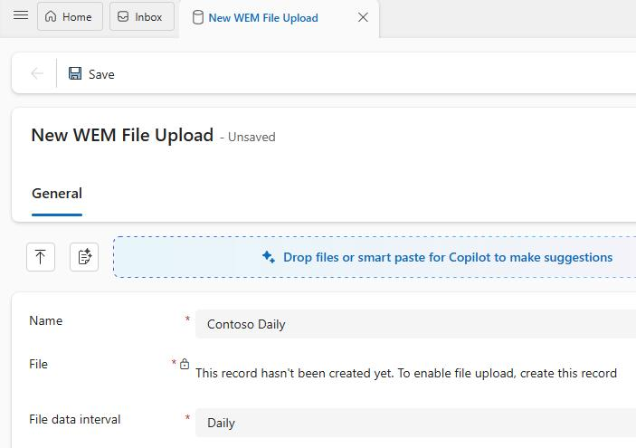

5. Select **Choose File**.

6. Go to the folder that you downloaded and extracted in Exercise 01, Task 2. In the **Service Transformation with AI** subfolder, select **daily data-20250911** and then select **Open**.

7. On the command bar, select **Save**. 

    > 
    >   You will not receive any confirmation that the file was saved. 

    > 

8. Close the **Contoso Daily** tab. 

    

9. On the command bar, select **Home**.

    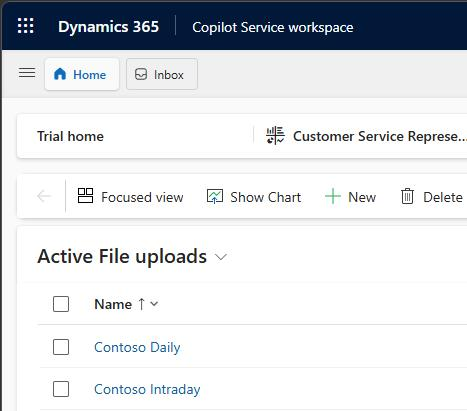

---

## Task 08: Create short-term forecasts

1. In **Copilot Service Workspace**, select **Workforce Management** and then select **Forecasting**.

    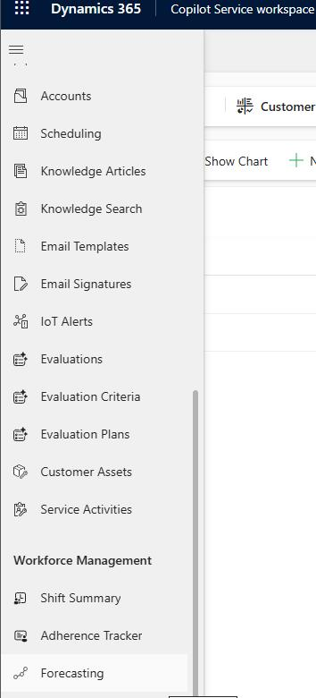

2. On the command bar, select **+ New** and then select **Short Term forecast scenario**.

    

3. Configure the forecast as follows:

    **Name:** `Sept Short term - Conversation`

    - **Duration:** 42

    - **Interval:** Short Term

    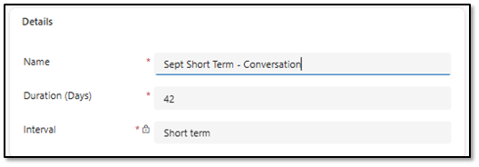

4. Configure the **Historical data** section as follows:

    Data source: External

    - External data: `Contoso Intraday`

    

5. In the **Configuration parameters** section, in the **Forecast entity** field, select **Conversation**.

    

6. On the command bar, select **Save**.

7. On the command bar, select **Run Forecast scenario**. This schedules the scenario to be run.

    

    - Close the **Sept Short Term -Conversation** tab.

    

---

## Task 09: Create a long-term forecast

Now that you have created a short-term forecast, you will create a long-term forecast.

1. In **Copilot Service Workspace**, select **Workforce Management** and then select **Forecasting**.

    

2. On the command bar, select **+ New** and then select **Long Term forecast scenario**.

    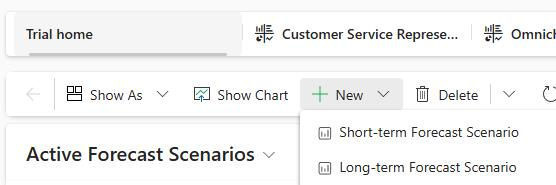

3. Configure the forecast as follows:

    **Name:** `Sept Long Term - Conversation`

    - **Duration:** 180

    - **Interval:** Long Term

    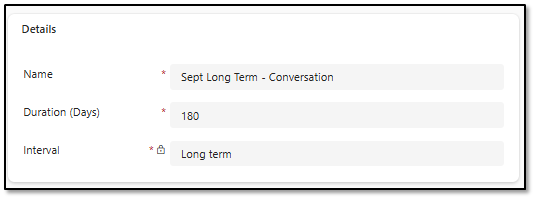

4. In the **Historical data** section, configure as follows:

    Data source: External

    - External data: Contoso Daily

    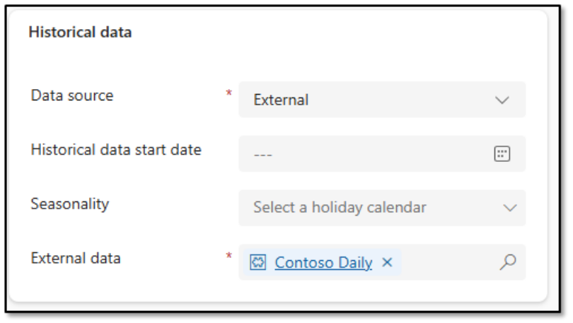

5. In the Forecast entity field, select **Conversation**.

6. On the command bar, select **Save**.

7. On the command bar, select **Run Forecast scenario**. This schedules the scenario to be run.

    

    - Close the **Sept Long Term - Conversation** tab.

    

---

## Task 10: Configure short-term case forecasts

1. In **Copilot Service Workspace**, select **Workforce Management** and then select **Forecasting**.

    

2. On the command bar, select **+ New** and then select **Short Term forecast scenario**.

    

3. Select **Short Term forecast scenario**.

4. Configure the forecast as follows:

    Name: `Sept Short Term - Case`

    - Duration: **42**

    - Interval: **Short Term**

    

5. Configure the **Historical data** section as follows:

    Data source: **External**

    - Historical data start date: **1/1/2025**

    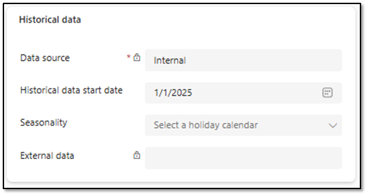

6. In the Configuration parameters section, configure as follows:

    Forecast entity: **Case**

    - Channels: Select All

    - Queues: `Default entity queue`

    > 
    >   To select the queue, in the **Queues** field, select the **Search** icon and then select **Advanced**. Then, search for and select **Default entity queue**. 

    > 

    

7. On the command bar, select **Save**.

8. On the command bar, select **Run Forecast scenario**. This schedules the scenario to be run.

    

    - Close the **Sept Short Term - Case** tab.

    

---

## Task 11: Configure long-term case forecasts

1. In **Copilot Service Workspace**, select **Workforce Management** and then select **Forecasting**.

    

2. On the command bar, select **+ New** and then select **Long Term forecast scenario**.

3. Configure the forecast as follows:

    **Name:** `Sept Long Term - Case`

    - Duration: 180

    - Interval: Long term

    

4. Configure the**Historical data** section as follows:

    Data source: **Internal**

    - Historical data start date: **1/1/2025**

    

5. In the Configuration parameters section, configure as follows:

    Forecast entity: **Case**

    - Channels: Select All

    - Queues: `Default entity queue`

    

6. On the command bar, select **Run Forecast scenario**. This schedules the scenario to be run.

    - Close the **Sept Long Term - Case** tab.

---
