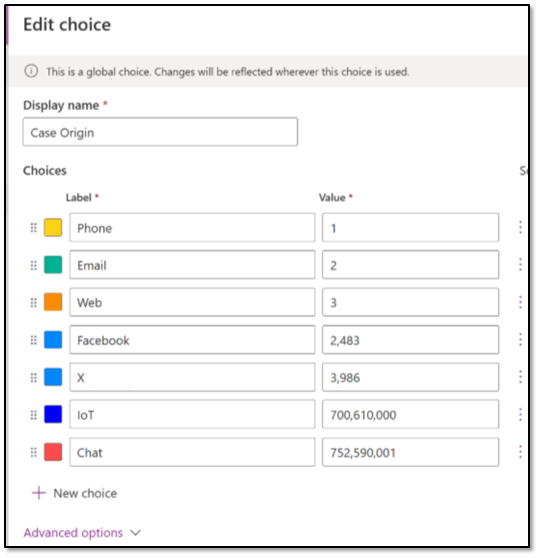
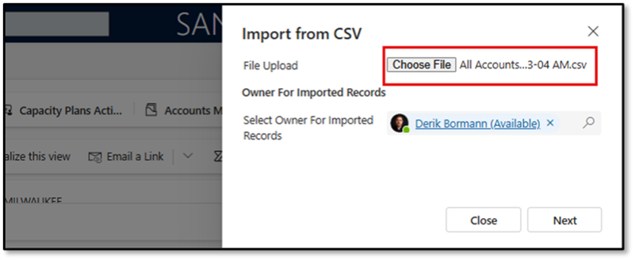
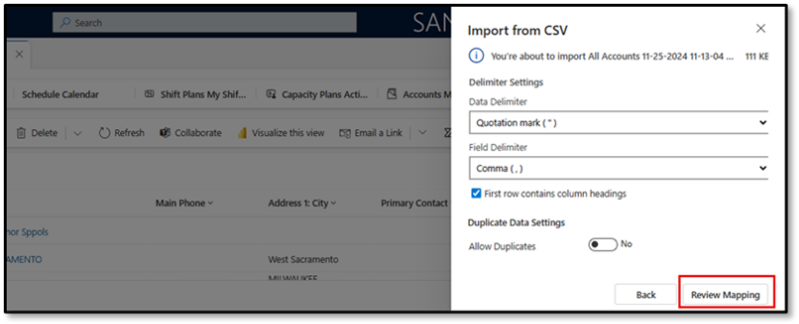
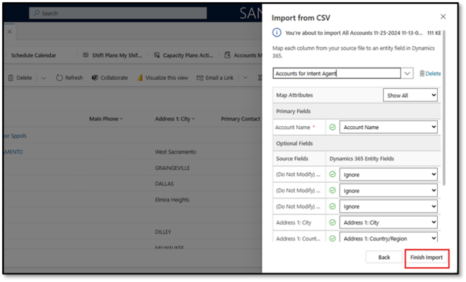

# Import historical data

In this section, you'll import historical contacts, accounts, and cases into your environment. This data is used by agents to provide realistic demo experiences.

---

## Task 12: Update the Origin column in your environment

1. In the Excel workbook there are references to X and Chat as part of the **Origin** column.  Neither of these are in your demo tenant which means we will get an error when we attempt to import cases. To fix this we are going to update the Origin column.

    - In a new browser tab, go to Https://make.powerapps.com.

2. In the left navigation pane, select **Tables**.

3. Switch the view to all tables and locate the **Case** table.

4. On the **Case** tables **Properties** screen, select **Columns**.

5. Locate and open the **Origin** column.

6. Under the **Sync this choice with** field, select **Edit Choice**.

7. Locate the **Twitter** choice option, and change the **Label** to **X**.

8. Select + **New Choice**.

9. Set the **Label** to **Chat.**
    Your completed Origin Column should resemble the image below: (Do not worry if your values do not match exactly.  We are only concerned with the Labels.)

    

---

## Task 13: Import supporting Contacts into your environment

1. Open the Customer Service Workspace in your environment.

2. Expand the **site-map**.

3. Using the Navigation on the left, select **Contacts**.

4. On the **My Active Contact** screen, select **Import from Excel**  and then select **CSV**.

5. Select **Choose File**.

    

6. Select the Contacts file included in your materials and select **Open**.

7. Select **Next**.

8. On the Import from CSV screen, select **Review Mapping**.

    

9. Map your data using the following steps:

    1. In the **Name your data map** field, enter `Contacts for Intent Agent`.

    1. Set all the **Do not Modify** fields to **Ignore**.

    1. Set **Full Name** to **Ignore**.

10. Select **Finish Import**.

    

    > 
    >   To monitor the progress, select **Track progress**.

    >   The contacts that you import here will be used as Primary Contacts for the accounts you are importing next, you will NEED TO WAIT until all of the contacts have been imported.

    > 

---

## Task 14: Import supporting accounts into your environment

1. If necessary, open the **Customer Service Workspace** in your environment.

2. Expand the site-map.

3. In the left navigation pane, select **Accounts**.

4. On the **My Active Accounts** screen, select **Import from Excel** > **CSV**

5. Select **Choose File**.

    

6. Select the Contacts file included in your materials and select Open.

7. Select **Next**.

8. On the Import from CSV screen, select **Review Mapping**  .

    

9. Map your data using the following steps:

    1. In the **Name your data map** field, enter `Accounts for Intent Agent`.

    1. Set all the **Do not Modify** fields to **Ignore**.

10. Select **Finish Import**.

    

    > 
    >   To monitor the progress, select **Track progress**.

    >   The Accounts that you import here will be used as Customers for the Cases you are importing next; you will NEED TO WAIT until all of the Accounts have been imported.

    > 

---

## Task 15: Import supporting cases into your environment

1. If necessary, open the Customer Service Workspace in your environment.

2. Expand the site-map.

3. In the left navigation pane, select **Cases**.

4. On the My Active Accounts screen, select **Import from Excel** and then select **CSV**.

5. Select **Choose File**.

    

6. Select the **Cases** file included in your materials and then select **Open**.

7. Select **Next**.

8. On the **Import from CSV** screen, select **Review Mapping**.

9. Map your data using the following steps:

    1. In the **Name your data map** field, enter `Cases for Intent Agent`.

    1. Map the **Origin (OptionSet)** to **Origin**.

    1. Set all the **Do not Modify** fields to **Ignore**.

    1. Set the following to **Ignore**: **Escalated On**, **Last Interaction**, **On Hold time**.

    1. If there are any other unmapped fields, set those to **Ignore** as well.

10. Select **Finish Import**.

    

    > 
    >   To monitor the progress, select **Track progress**.

    >   It will take about 6 hours for all of this information to import. While you can continue to use your system during that time, it is recommended that you do not move on to the next Exercise until the import job has been completed.

    > 

---
