# Create and configure a support site

As part of this demo, when the agent hands the conversation off to a live agent, you'll be demonstrating the chat functionality as it will be the communication method with the customer. The Dynamics 365 embedded agents work off conversation records in addition to case, so it is important that you have at least one channel configured.

> 
>   You're going to be using a Chat channel, but can also use a different channel such as SMS, Teams, or WhatsApp. 

> 

---

## Task 16: Create a support site

1. In Edge, go to `https://make.powerpages.microsoft.com`.

2. On the Home page, in the **Other ways to create a site** section, select **Start with a Template**.

    

3. Move down the page to the **Business-need** templates and then select **Customer Self Service Portal**. Then, select **Choose this template**.

    

4. Configure as defined:

    - **Give your site a name**: `Contoso Self Service`

    - **Create a web address**: `Pick a URL for the site`

    > 
    >   In the screenshot below, we used the Environment name to guarantee uniqueness for the URL.

    > 

    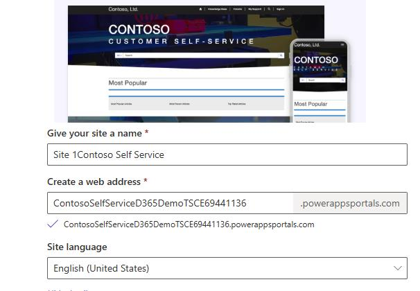

5. Select **Done**.

    > 
    >   It can take up to 30 minutes for the site creation process to complete.

    > 

6. Leave the page open.

---

## Task 17: Make the site public

1. Locate the **Contoso Self Service** site you created earlier and select **Edit**.

    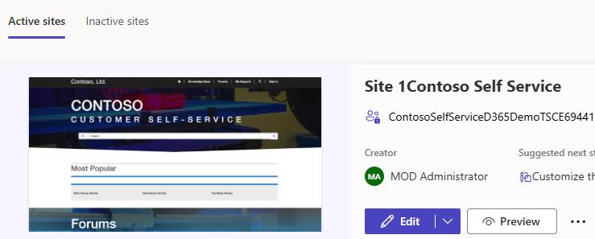

2. In the left pane, select **Setup**.

    

3. Select **Visit Security**.

    

4. In the **Security** pane, select **Site visibility**.

    

5. In the **Site visibility** section, select **Public**.

    > 
    >   [!alert] If you see a message stating that access is restricted, in the **Grant site access** section, enter your administrative credential and then select **Share**.

    >   
    >   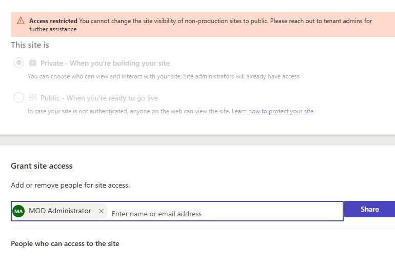

    > 

6. On the message that is displayed, select **Set to public**.

    > 
    >   In production, you typically wouldn't make a site public. For this demo, we're enabling public access to simplify setup and improve the experience. Make sure the site contains no confidential or sensitive information.

    > 

---

## Task 18: Create a demo user for the portal

To effectively demonstrate features such as Chat and other items, you'll want to be logged into your portal as a user. This information will be passed over into chat sessions and other items.

1. In the left pane, select **Home**.

    

2. On the list of **Active Sites**, under **Contoso Self Service**, select the ellipsess (**…**) next to the **Preview** button and then select **Portal management**.

    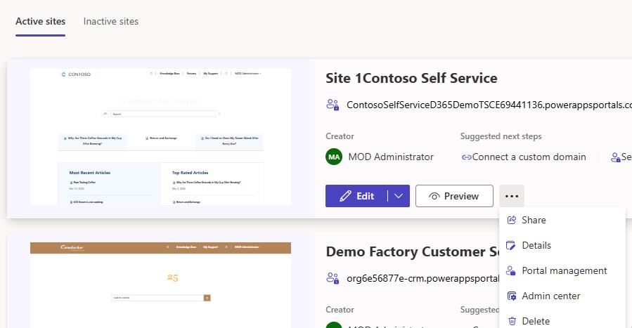

3. In the left pane, in the **Security** section, select **Contacts**.

    

4. On the **My Active Contacts** page, on the command bar, select **+ New**.

    

    > 
    >   When creating a portal user, you need to include information such as username and password. This information is not available on the standard contact form so you'll need to make sure that you're using the portal Ccontact from. This contains specific items that allow you to configure portal contact details.

    > 
    [more...](#)

5. Select the down arrow next to **Contact** and then select **Portal Contact**.

    

6. Configure the **General** tab as follows:

    - **First Name:** `Michael`

    - **Last Name:** `James`

7. Select the Web Authentication tab.

    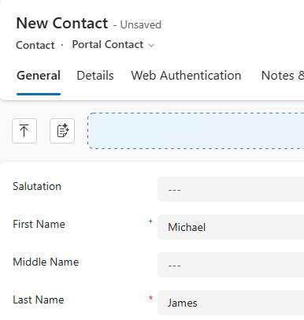

8. Configure the **Web Authentication** tab as follows:

    - **Username:** `Mjames`

    - **Login Enabled:** `Yes`

    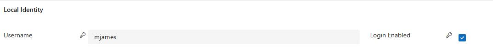

9. On the command bar, select **Save**. Leave the page open.

    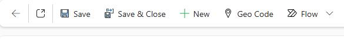

10. On the command bar, select **Related** and then select **Web Roles**.

    

11. On the command bar, select **Add Existing Web Role**.

    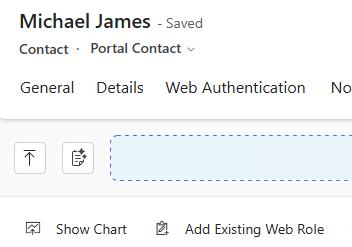

12. In the **Look for Records** field, enter `Auth` and then select **Authenticated Users**.

    > 
    >   If you see more than one entry in the search results, select the one that references your site.

    > 

    

13. Select **Add**.

14. On the **Command bar**, select **Change Password**.

    

15. On the **Change password for Portals contact** screen, enter `Pa55.w0rd` and then select **Next**.

    

16. Select **Done**.

    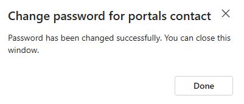

---

## Task 19: Preview and test the site

1. In Edge, go to `https://make.powerpages.microsoft.com`.

2. In **Active Sites**, locate the **Contoso Self Service** site you created earlier and then select **Preview**.

3. From the menu that appears, select **Desktop**.

    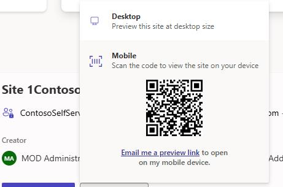

4. In the confirmation dialog, select **Consent on behalf of your organization** and then select **Accept**.

    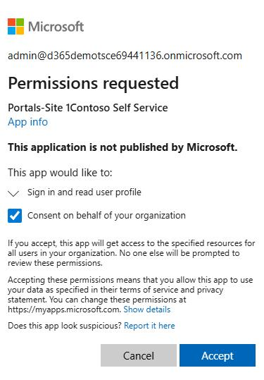

5. On the command bar, select **Sign In**.

    

6. In the **Username** field, enter **mjames**.

7. In the **Password** field, enter **Pa55.w0rd**.

8. Select **Remember Me**.

9. Select **Sign in**.

10. Select **Home**.

    

11. On the command bar, select **Knowledge Base**.

    

12. To create a case, select **My Support**.

    > 
    >   If the account you're logged in with has any cases, they will appear here.

    > 

13. Select **Open a New Case**.

14. Complete the case as follows:

    - **Title:** Unit is overheating

    - **Case Type:** Problem

15. Select **Submit**.

---

## Task 20: Configure a chat channel

> 
>   We are going to be using a chat channel, but you may want to use a different channel such as SMS, Teams, or WhatsApp.  For detailed step-by-step configuration on how to set up each of those channels, See the **Channel Deployment** HOL document provided.

> 

> 
>   Even if you already have a chat channel configured, you'll NEED to do TASK 4 to ensure that the Contoso Coffee Assistant agent you created earlier is associated with the correct portal.

> 

---

## Task 21: Create a chat workstream

Each channel that is deployed requires a workstream. Workstreams help to define how items will be routed and distributed. Through the work stream, you'll define settings such as the capacity that is consumed, how items should be distributed, routing rules, and more. Since your organization would like to surface a live chat widget on their site, you'll need to configure a work stream to facilitate it.

1. Open the **Copilot Service admin center** app.

    

2. In the left pane, in the **Customer support group** section, select **Workstreams**.

    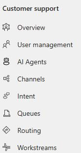

3. On the **All workstreams** page, select **+ New workstream**.

    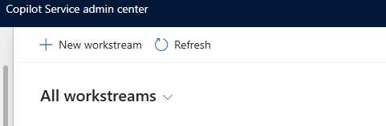

4. Select **Inbound for the work** and then select **Next**.

    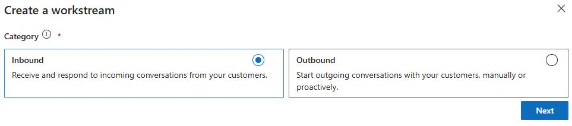

5. In the Name field, enter `Live Chat`.

6. Configure the workstream as follows and then select **Create**.

    | Option | Value |
    | --- | --- |
    | Type: | **Messaging** |
    | Channel: | **Chat** |
    | Work Distribution Mode: | **Push** |

    

7. In the **AI Agent** section, select **+ Add AI Agent**.

    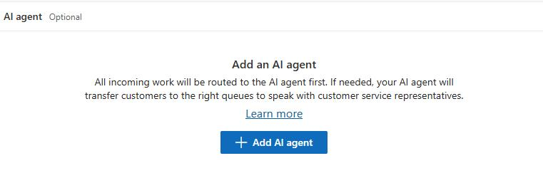

8. From the list of agents, select the **Coffee Support Assistant** agent you created earlier and then select **Connect**.

    !
    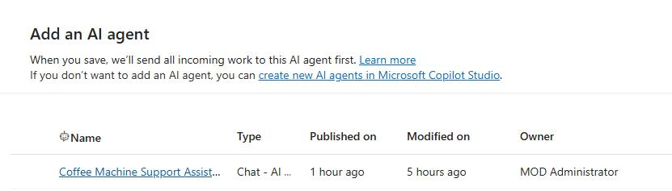

---

## Task 22: Set up a chat channel

1. On the **Live chat** tile, select **Set up Chat**.

    

2. In the general configuration screen, enter **Portal Live Chat** for the name.

3. Under **General Configuration**, configure as follows and then select **Next**.

    | Option | Value |
    | --- | --- |
    | Name: | `Portal Live Chat` |
    | Window Size: | **Default** |
    | Windows Position: | **Bottom Right** |
    | Window Position: | **Bottom** |

    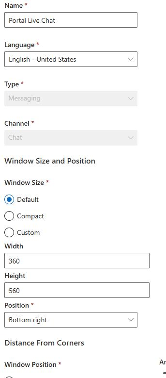

4. On the **Color Settings** page, change the theme color to **Cobalt** and then select **Next**.

    

5. Configure the header page as follows and then select **Next**:

    - **Content:** `Graphic + Text`

    - **Header Message:** `Let's talk`

6. On the **Chat Widget** page, leave everything as is and select **Next**.

7. In the **Behaviors** screen, set **Pre-conversation survey** to **On**.

    

8. On the **Survey questions** tile, select **+ Add**.

    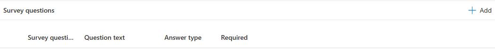

9. Configure the survey question as follows and then select **Confirm**:

    | Option | Value |
    | --- | --- |
    | Survey Question name: | `CaseType` |
    | Question text: | `What is the reason for reaching out today?` |
    | Answer type: | `Option set` |
    | Option set values: | `Billing; Account; Question; Support` |

    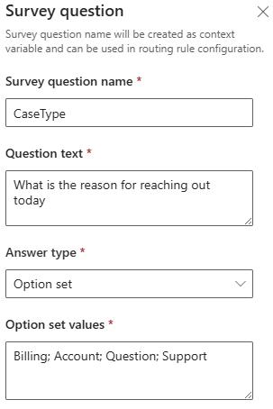

10. Set **Authentication settings** to **Off**.

11. Select **Next**.

12. On the **User feature**s page, set **File attachments** to **On**, then select **Next**.

    

13. On the **Notifications** page, select **Next**.

14. On the **Review and Finish** page, select **Create Channel**.

    

---

## Task 23: Deploy your chat widget to a portal

After your chat channel has completed, you'll be able to deploy it to your organizations portal. On the channel setup complete screen, you'll be provided with a code snippet that you can use to deploy to the portal.

1. On the channel setup complete page, select **Copy** and then select **Done**.

    

2. In a new tab within the same browser session, go to `https://make.powerapps.com`.

3. In the left pane, select **Apps** and then select **Portal Management**.

    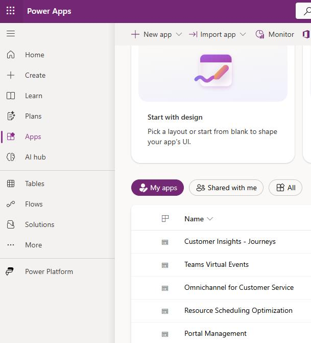

4. In the **Portal Management** app, in the **Content** section, select **Content Snippets**.

    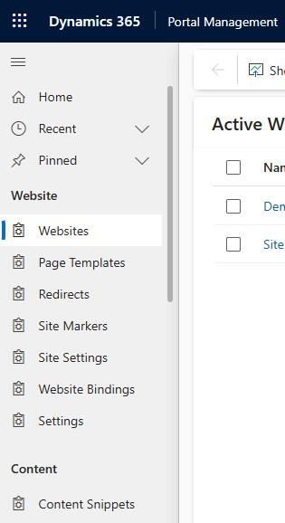

5. In the **Search for Records** Box, enter `Chat` and press **Enter**. Open the **Chat Widget Code** content snippet for your customer service portal.

    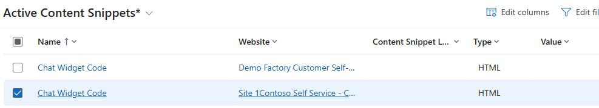

6. In the **Value (HTML)** field, paste the code that you copied  when you deployed the widget.

7. Select **Save and Close**.

    > 
    >   It can take up to 15 minutes before you'll see the chat widget available on your portal.

    > 

---

## Task 24: Verify your Chat widget has been deployed

1. If you do not already have it open in a different tab, open a new browser tab, and navigate to [https://make.powerapps.com](https://make.powerapps.com).

2. Navigate to Apps and locate the Customer Self-Service Portal that you created in the previous exercise.

3. Open the Customer **Self Service Portal**.

4. Verify that your chat widget is being displayed on the Portal.

    > 
    >   If you're still not seeing the chat widget in the portal, look at the working hours associated with the chat to verify that you're within the work hours defined.

    > 

---
