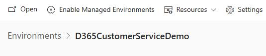
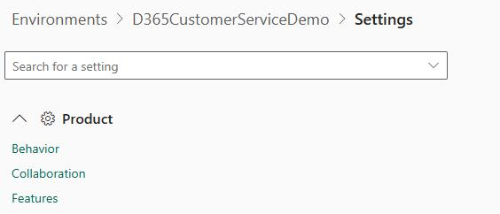

# Other prerequisites

In this section, you'll enable additional features required for the demo environment.

---

## Task 25: Enable AI form fill assistance

1. In Edge, go to `https://admin.powerplatform.microsoft.com`.

2. If prompted, sign in by using the administrator credentials for your demo enviornment.

3. In the left pane, select **Manage**.

    

4. In the **Manage** pane, select **Environments**.

    

5. On the **Environments** page, select your demo environment.

    

6. On the command bar, select **Settings**.

    

7. Expand **Product**, and then select **Features**.

    

8. Move down the page to locate the **AI form fill assistance** section. Configure the section as follows:

    - **Automatic suggestions**: On

    - **Smart paste and file suggestions (Production Ready Preview)**: On

    - **Form fill assist toolbar**: On

    

9. Select **Save**.

---

[← Section 05](05.html){: .btn .mr-2 }
[Summary →](07.html){: .btn .btn-purple }
