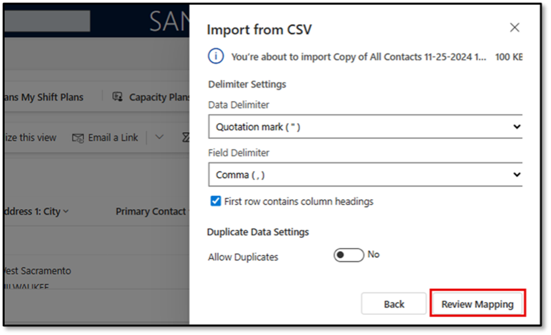
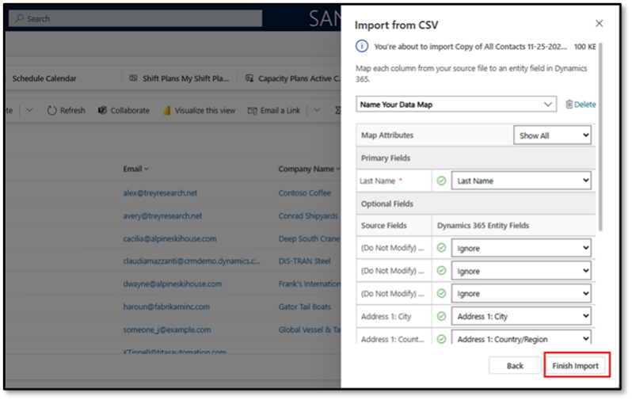

### Task 13: Import supporting Contacts into your environment

1. Open the Customer Service Workspace in your environment.

2. Expand the **site-map**.

3. Using the Navigation on the left, select **Contacts**.

4. On the **My Active Contact** screen, select **Import from Excel**  and then select **CSV**.

5. Select **Choose File**.

    

6. Select the Contacts file included in your materials and select **Open**.

7. Select **Next**.

8. On the Import from CSV screen, select **Review Mapping**.

    

9. Map your data as follows:

10. In the Name you data map field, enter Contacts for Intent Agent.

11. Set all the **Do not Modify** fields to **Ignore**.

12. Set **Full Name** to **Ignore**.

13. Select **Finish Import**.

    

    > 
    >   To monitor the progress, select **Track progress**.

    >   The contacts that you import here will be used as Primary Contacts for the accounts you are importing next, you will NEED TO WAIT until all of the contacts have been imported.

    > 

---
