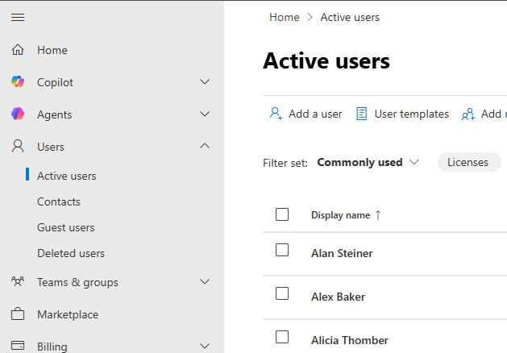
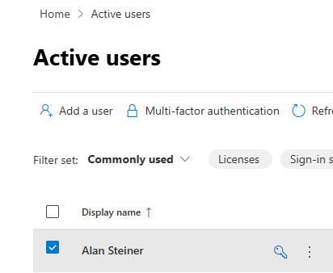
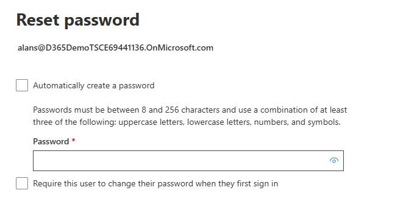
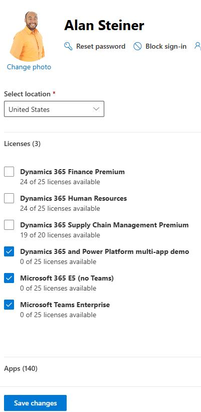

### Task 1: Identify the user accounts that you have in your environment

When cases are imported into the application, they are assigned to different users. 

Your demo tenant users may be different from the ones listed (For example, you have Amy Adams instead of Amy Alberts, or a different name for Anita Montero, Benjamin Mcphee or any other user.

---

#### 01: Identify which user accounts are present

-  In Edge, go to `Https://admin.microsoft.com`. Sign in by using the administrator credentials for your demo enviornment.

-  In the left pane, expand **Users** and select **Active Users**.

-  Identify whether you have the following user accounts created in your demo environment: 

Alan Steiner

- Alex Baker

- Alica Thomber

- Amy Alberts

- Anita Montero

- Benjamin Mcphee

- David Mallory

- Molly Clark

- Nancy Warner

- Renee Lo

- Spencer Low

---

#### 02: Check the configuration for existing user accounts

> 
>   Repeat this set of steps to configure each existing user account.

> 

-  Select a user account.

-  At the top of the user details pane, select **Reset password**.

-  On the **Reset password** pane, clear both checkboxes.

-  In the **Password** field, enter `DemoEnvPa55w.rd` and then select **Reset password**.

> 
>   You will use this password any time you need to sign in as one of the listed users.

> 

-  On the **Password has been reset** pane, select **Close**.

-  Select the user account again.

-  On the command bar for the user details pane, select **Licenses and apps**.

-  Ensure that the following licenses are assigned. Add any missing licenses and then select **Save changes**.

Microsoft 365 E5 (No Teams)

- Microsoft Teams Enterprise

- Dynamics 365 and Power Platform multi-app demo

---

#### 03: Add missing user accounts

> 
>   Repeat this set of steps to add each missing user account.

> 

-  If necessary, select **Users** and then select **Active Users**.

-  Select **Add a user**.

-  Enter values for the **First name**, **Last name**, and **Username** fields.

-  Clear **Automatically create a password**.

-  Enter a **password**. Clear **Require the user to change password**.

-  Select **Next**.

-  Assign the Following licenses:

Microsoft 365 E5 (No Teams)

- Microsoft Teams Enterprise

- Dynamics 365 and Power Platform multi-app demo

- Select **Next**.

- Select **Finish**.

---
