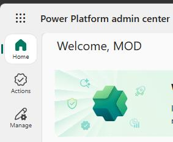
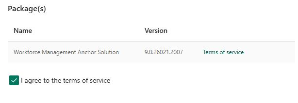

### Task 1: Enable Workforce Management

-  Open a web browser and go to `https://admin.powerplatform.microsoft.com`.

- Sign in using your administrator credentials.

-  In the left pane, select **Manage**.

-  In the **Manage** pane, in the **Products** section, select **Dynamics 365 Apps**.

-  Locate the **Workforce Management for Customer Service** app.

-  Select the ellipsis (**…**) and then select **Install**.

-  In the **Install Workforce Managermet for Customer Service** pane, select your environment.

-  Select **I agree to the terms of service** and then select **Install**.

> 
>   It can take up to an hour for workforce management to install in your environment. You can continue on with the tasks in this exercise while installation is in process.

> 

---
