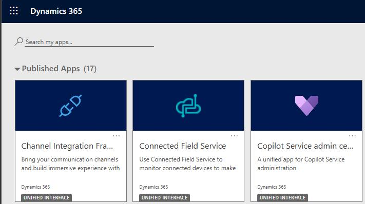
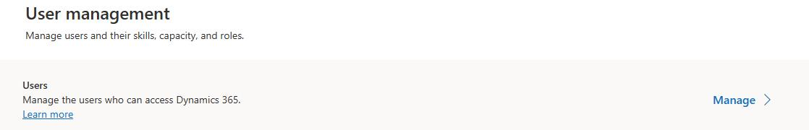
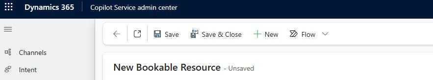
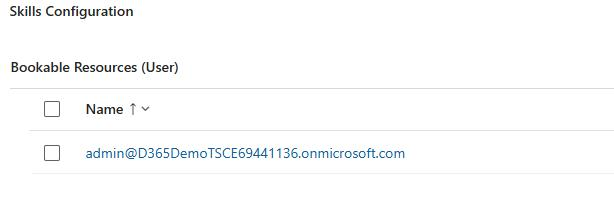
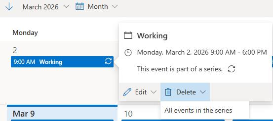

### Task 2: Create bookable resources

For service representatives to be scheduled for activities, you must create a bookable resource entity for each representative.

-  In Edge, go to Dynamics 365. The URL should resemble **https://org6e56877e.crm.dynamics.com/**.

-  If prompted, sign in by using the administrator credentials for your demo enviornment.

-  On the **Published Apps** page, select **Copilot Service admin center**.

-  In the left pane, In the **Operations** section, select **Workforce management**.

-  On the **Workforce management** page, in the **Workforce setup** section, select **View**.

-  In the **Users** section, select **Manage**.

-  In the **Enabled Users** list, search for and select your administrative user account.

-  On the user page, on the command bar, select **Omnichannel**.

-  On the **Skills Configuration** tile, select the vertical ellipses (**…**) and then select **+ New Bookable Resource**.

-  Enter the following details:

Resource Type: **User**

- Name: Your admin user 

- User: Set to your user account

- Time zone: Select your time zone 

-  On the command bar, select **Save and Close**.

-  On the **Skills Configuration** tile, select the bookable resource record you just created.

-  On the command bar for the resource, select **Work hours**.

-  Select one event on the calendar. Select **Delete** and then select **Aall events in the series**. Then, in the confirmation dialog, select **Delete**.

> 
>   This step deletes all working hours for the user.

> 

-  On the command bar for the calendar, select **+ New** and then select **Workhing hours**.

-  Configure the working hours by using the following information and then select **Save**:

**Repeat**: Every Week

- **Days:** Monday - Friday

- **Start time:** 8:00 AM

- **End time:** 5:00 PM

- **Time Zone:** Set to your timezone.

-  Repeat Steps 7 through 11 to create bookable resource records and define working hours for the following users:

Alan Steiner

- Alex Baker

- Alica Thomber

- Amy Alberts

- Anita Montero

- Benjamin Mcphee

- David Mallory

- Molly Clark

- Nancy Warner

- Renee Lo

- Spencer Low

---
