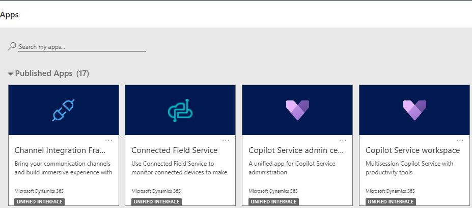
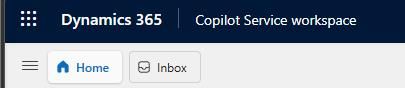
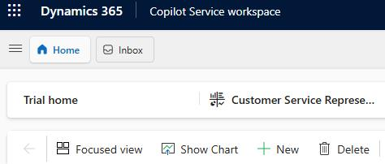
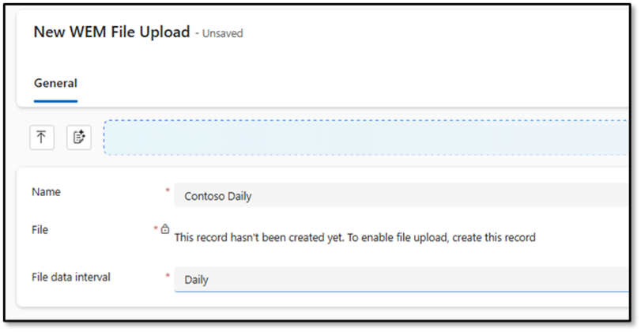
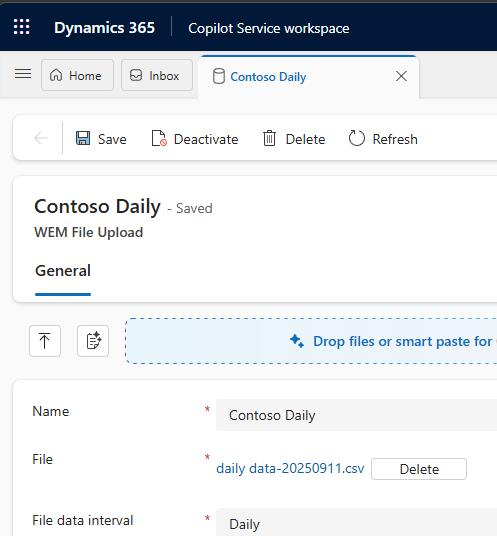

### Task 4: Import daily and intraday external data

> 
>   BEFORE YOU BEGIN: The two files that you will be importing include information based on dates. DO NOT open the files in excel before importing.  It will change the dates and impact on the way your demo will work.

> 

---

#### 01: Import intraday data

-  Extract the files from the zip file that was included in your class materials.

-  At the top of the page, select **Copilot Service admin center**. This displays a list of apps.

-  In the list of apps, select **Copilot Service workspace**.

-  In the left pane, in the **Workforce management** section, select **Forecast External Data**.

> 
>   At the top left of the page, you may need to select the three parallel lines to see the left pane.

>   
>   

> 

-  On the command bar, select **+ New**.

-  In the **Name** field, enter `Contoso Intraday`.

-  In the **File data interval** field, select **Intraday**.

-  On the command bar, select **Save**.  

> 
>   You will not be able to upload a file until you save the record.

> 

-  Select **Choose File**.

-  Go to the folder that you downloaded and extracted in Exercise 01, Task 2. In the **Service Transformation with AI** subfolder, select **intraday data-20250911** and then select **Open**.

-  On the command bar, select **Save**. 

> 
>   You will not receive any confirmation that the file was saved. 

> 

-  Close the **Contoso Intraday** tab. 

-  On the command bar, select **Home**.

---

#### 02: Import daily data

-  On the command bar, select **+ New**.

-  In the **Name** field, enter `Contoso Daily`.

-  In the **File data interval** field, select **Daily**.

-  On the command bar select **Save**.

-  Select **Choose File**.

-  Go to the folder that you downloaded and extracted in Exercise 01, Task 2. In the **Service Transformation with AI** subfolder, select **daily data-20250911** and then select **Open**.

-  On the command bar, select **Save**. 

> 
>   You will not receive any confirmation that the file was saved. 

> 

-  Close the **Contoso Daily** tab. 

-  On the command bar, select **Home**.

---
