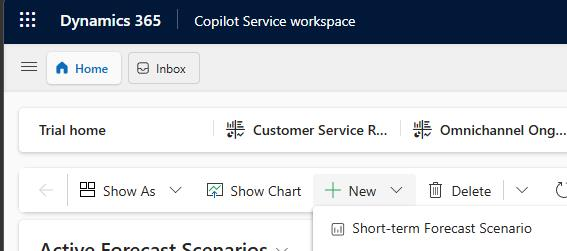
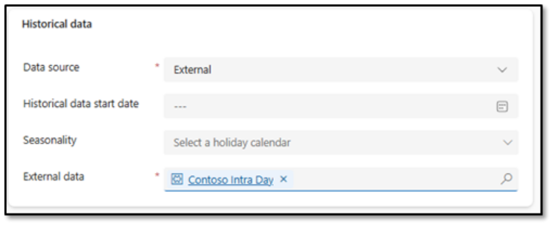
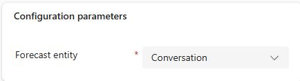
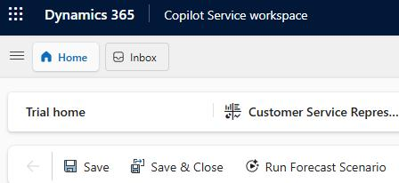
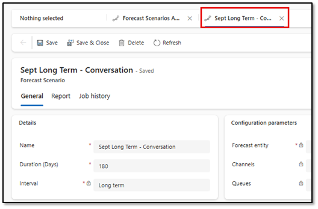

### Task 5: Create short-term forecasts

-  In **Copilot Service Workspace**, select **Workforce Management** and then select **Forecasting**.

-  On the command bar, select **+ New** and then select **Short Term forecast scenario**.

-  Configure the forecast as follows:

**Name:** `Sept Short term - Conversation`

- **Duration:** 42

- **Interval:** Short Term

-  Configure the **Historical data** section as follows:

Data source: External

- External data: `Contoso Intraday`

-  In the **Configuration parameters** section, in the **Forecast entity** field, select **Conversation**.

-  On the command bar, select **Save**.

-  On the command bar, select **Run Forecast scenario**. This schedules the scenario to be run.

- Close the **Sept Short Term -Conversation** tab.

---
