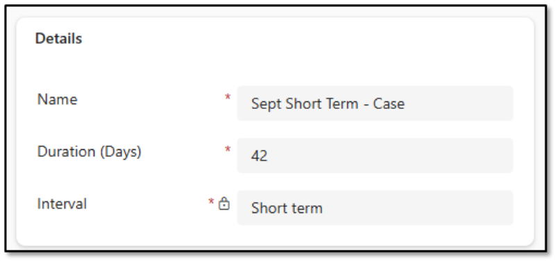
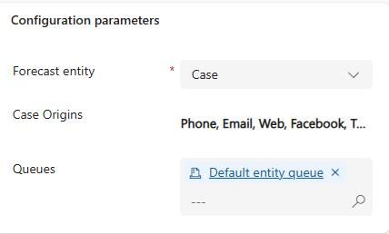

### Task 7: Configure short-term case forecasts

-  In **Copilot Service Workspace**, select **Workforce Management** and then select **Forecasting**.

-  On the command bar, select **+ New** and then select **Short Term forecast scenario**.

-  Select **Short Term forecast scenario**.

-  Configure the forecast as follows:

Name: `Sept Short Term - Case`

- Duration: **42**

- Interval: **Short Term**

-  Configure the **Historical data** section as follows:

Data source: **External**

- Historical data start date: **1/1/2025**

-  In the Configuration parameters section, configure as follows:

Forecast entity: **Case**

- Channels: Select All

- Queues: `Default entity queue`

> 
>   To select the queue, in the **Queues** field, select the **Search** icon and then select **Advanced**. Then, search for and select **Default entity queue**. 

> 

-  On the command bar, select **Save**.

-  On the command bar, select **Run Forecast scenario**. This schedules the scenario to be run.

- Close the **Sept Short Term - Case** tab.

---
