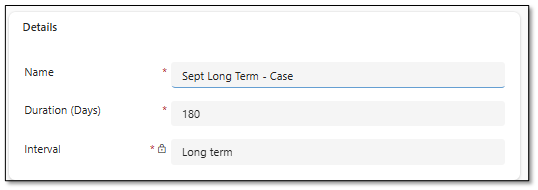
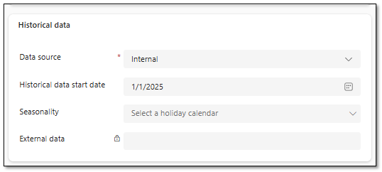
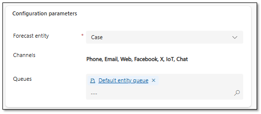

### Task 8: Configure long-term case forecasts

-  In **Copilot Service Workspace**, select **Workforce Management** and then select **Forecasting**.

-  On the command bar, select **+ New** and then select **Long Term forecast scenario**.

-  Configure the forecast as follows:

**Name:** `Sept Long Term - Case`

- Duration: 180

- Interval: Long term

-  Configure the**Historical data** section as follows:

Data source: **Internal**

- Historical data start date: **1/1/2025**

-  In the Configuration parameters section, configure as follows:

Forecast entity: **Case**

- Channels: Select All

- Queues: `Default entity queue`

-  On the command bar, select **Run Forecast scenario**. This schedules the scenario to be run.

- Close the **Sept Long Term - Case** tab.

---
