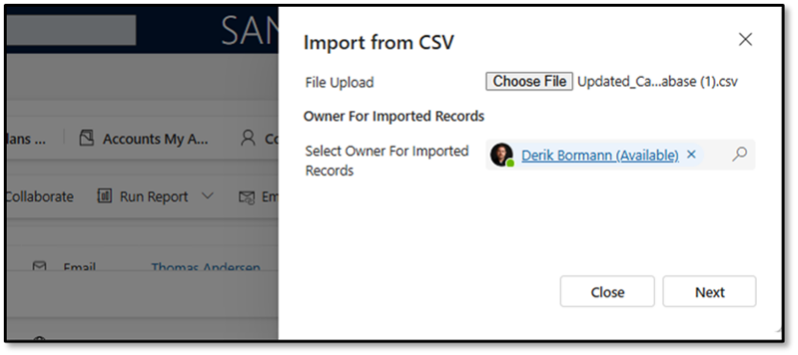
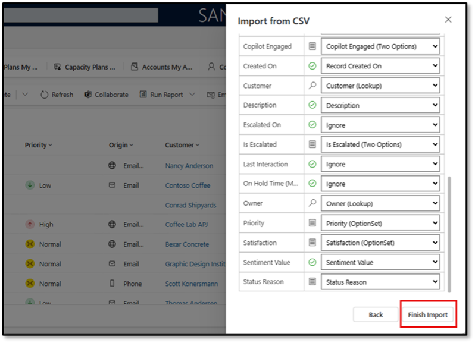

### Task 4: Import supporting cases into your environment

-  If necessary, open the Customer Service Workspace in your environment.

-  Expand the site-map.

-  In the left navigation pane, select **Cases**.

-  On the My Active Accounts screen, select **Import from Excel** and then select **CSV**.

-  Select **Choose File**.

-  Select the **Cases** file included in your materials and then select **Open**.

-  Select **Next**.

-  On the **Import from CSV** screen, select **Review Mapping**.

-  Map your data as follows:

-  In the **Name your data map** field, enter **Cases for Intent Agent**

-  Map the **Origin (OptionSet**) to **Origin**.

-  Set all the Do not Modify fields to **Ignore**.

-  Set the following to **Ignore**.

**Esclated On**

- **Last Interaction**

- **On Hold time**

-  If there are any other unmapped fields, set those to **Ignore** as well.

-  Select ** Finish Import**.

> 
>   To monitor the progress, select **Track progress**.

>   It will take about 6 hours for all of this information to import. While you can continue to use your system during that time, it is recommended that you do not move on to the next Exercise until the import job has been completed.

> 

---
