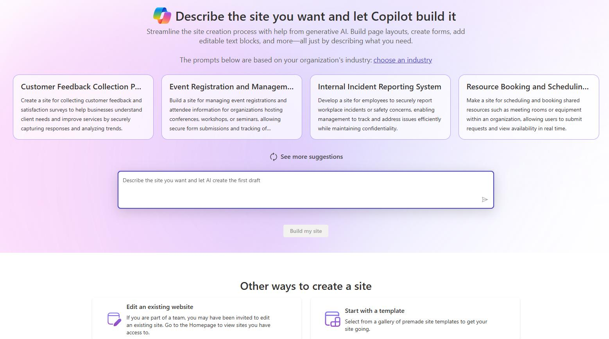
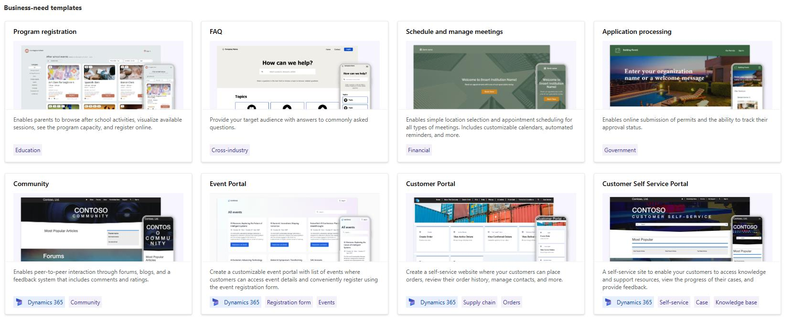

# Exercise 06: Create and configure a support site

As part of this demo, when the agent hands the conversation off to a live agent, you'll be demonstrating the chat functionality as it will be the communication method with the customer. The Dynamics 365 embedded agents work off conversation records in addition to case, so it is important that you have at least one channel configured.

> 
>   You're going to be using a Chat channel, but can also use a different channel such as SMS, Teams, or WhatsApp. 

> 

---

## Task 01: Create a support site

-  In Edge, go to `https://make.powerpages.microsoft.com`.

-  On the Home page, in the **Other ways to create a site** section, select **Start with a Template**.

-  Move down the page to the **Business-need** templates and then select **Customer Self Service Portal**. Then, select **Choose this template**.

-  Configure as defined:

**Give your site a name**: `Contoso Self Service`

- **Create a web address**: `Pick a URL for the site`

> 
>   In the screenshot below, we used the Environment name to guarantee uniqueness for the URL.

> 

-  Select **Done**.

> 
>   It can take up to 30 minutes for the site creation process to complete.

> 

-  Leave the page open.

---
