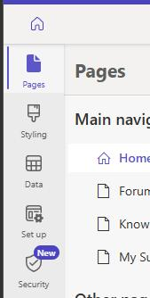
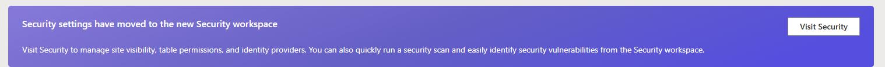
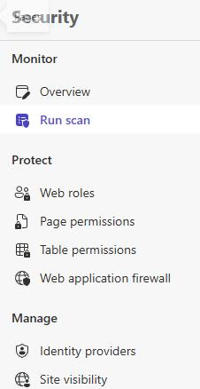

## Task 02: Make the site public

-  Locate the **Contoso Self Service** site you created earlier and select **Edit**.

-  In the left pane, select **Setup**.

-  Select **Visit Security**.

-  In the **Security** pane, select **Site visibility**.

-  In the **Site visibility** section, select **Public**.

> 
>   [!alert] If you see a message stating that access is restricted, in the **Grant site access** section, enter your administrative credential and then select **Share**.

>   
>   

> 

-  On the message that is displayed, select **Set to public**.

> 
>   In production, you typically wouldn't make a site public. For this demo, we're enabling public access to simplify setup and improve the experience. Make sure the site contains no confidential or sensitive information.

> 

---
