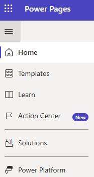
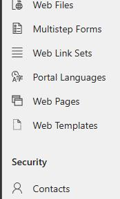
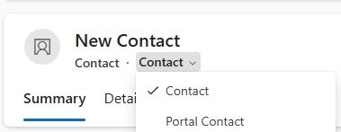
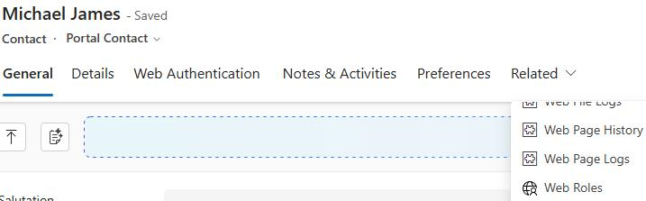
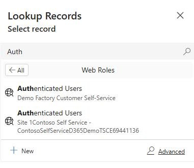
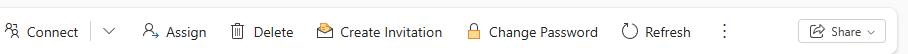
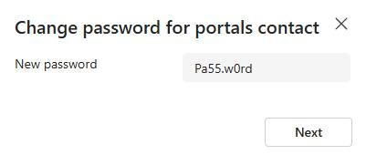

## Task 03: Create a demo user for the portal

To effectively demonstrate features such as Chat and other items, you'll want to be logged into your portal as a user. This information will be passed over into chat sessions and other items.

-  In the left pane, select **Home**.

-  On the list of **Active Sites**, under **Contoso Self Service**, select the ellipsess (**…**) next to the **Preview** button and then select **Portal management**.

-  In the left pane, in the **Security** section, select **Contacts**.

-  On the **My Active Contacts** page, on the command bar, select **+ New**.

> 
>   When creating a portal user, you need to include information such as username and password. This information is not available on the standard contact form so you'll need to make sure that you're using the portal Ccontact from. This contains specific items that allow you to configure portal contact details.

> 
[more...](#)

-  Select the down arrow next to **Contact** and then select **Portal Contact**.

-  Configure the **General** tab as follows:

**First Name:** `Michael`

- **Last Name:** `James`

-  Select the Web Authentication tab.

-  Configure the **Web Authentication** tab as follows:

**Username:** `Mjames`

- **Login Enabled:** `Yes`

-  On the command bar, select **Save**. Leave the page open.

-  On the command bar, select **Related** and then select **Web Roles**.

)

-  On the command bar, select **Add Existing Web Role**.

-  In the **Look for Records** field, enter `Auth` and then select **Authenticated Users**.

> 
>   If you see more than one entry in the search results, select the one that references your site.

> 

-  Select **Add**.

-  On the **Command bar**, select **Change Password**.

-  On the **Change password for Portals contact** screen, enter `Pa55.w0rd` and then select **Next**.

-  Select **Done**.

---
