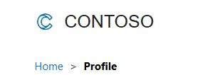

## Task 04: Make the site public

-  In Edge, go to `https://make.powerpages.microsoft.com`.

-  In **Active Sites**, locate the **Contoso Self Service** site you created earlier and then select **Preview**.

-  From the menu that appears, select **Desktop**.

-  In the confirmation dialog, select **Consent on behalf of your organization** and then select **Accept**.

-  On the command bar, select **Sign In**.

-  In the **Username** field, enter **mjames**.

-  In the **Password** field, enter **Pa55.w0rd**.

-  Select **Remember Me**.

-  Select **Sign in**.

-  Select **Home**.

-  On the command bar, select **Knowledge Base**.

-  To create a case, select **My Support**.

> 
>   If the account you're logged in with has any cases, they will appear here.

> 

-  Select **Open a New Case**.

-  Complete the case as follows:

**Title:** Unit is overheating

- **Case Type:** Problem

-  Select **Submit**.

---
