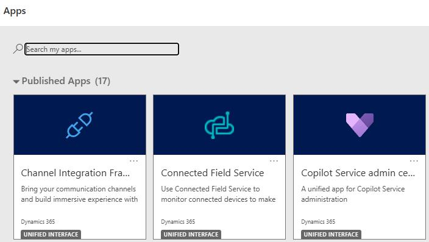
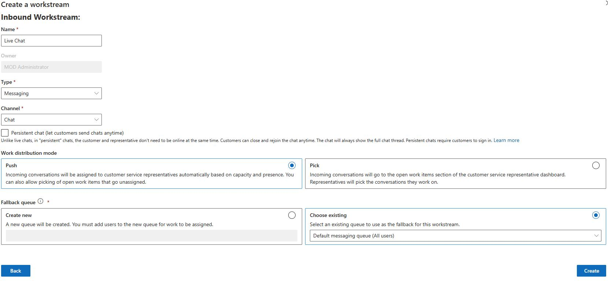

## Task 05: Create a chat workstream

Each channel that is deployed requires a workstream. Workstreams help to define how items will be routed and distributed. Through the work stream, you'll define settings such as the capacity that is consumed, how items should be distributed, routing rules, and more. Since your organization would like to surface a live chat widget on their site, you'll need to configure a work stream to facilitate it.

-  Open the **Copilot Service admin center** app.

-  In the left pane, in the **Customer support group** section, select **Workstreams**.

-  On the **All workstreams** page, select **+ New workstream**.

-  Select **Inbound for the work** and then select **Next**.

-  In the Name field, enter `Live Chat`.

-  Configure the workstream as follows and then select **Create**.

| Option | Value |

| Type: | **Messaging** |

| Channel: | **Chat** |

| Work Distribution Mode: | **Push** |

-  In the **AI Agent** section, select **+ Add AI Agent**.

-  From the list of agents, select the **Coffee Support Assistant** agent you created earlier and then select **Connect**.

!

---
