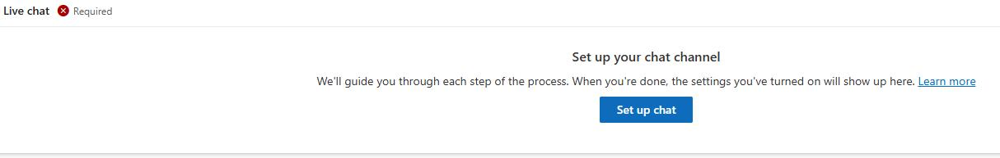
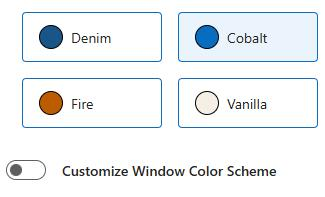
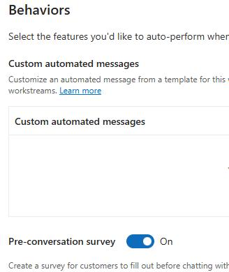
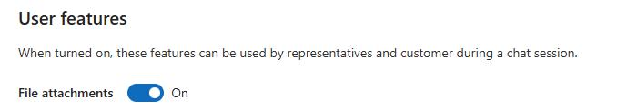
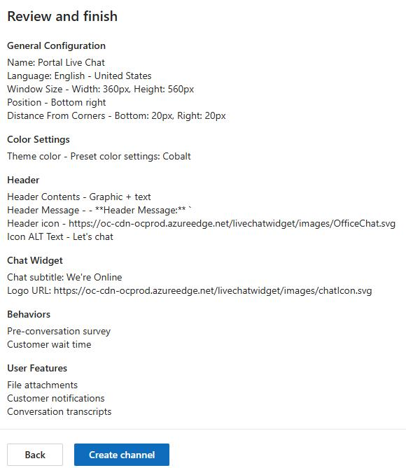

## Task 07: Set up a chat channel

-  On the **Live chat** tile, select **Set up Chat**.

-  In the general configuration screen, enter **Portal Live Chat** for the name.

-  Under **General Configuration**, configure as follows and then select **Next**.

| Option | Value |

| Name: | `Portal Live Chat` |

| Window Size: | **Default** |

| Windows Position: | **Bottom Right** |

| Window Position: | **Bottom** |

-  On the **Color Settings** page, change the theme color to **Cobalt** and then select **Next**.

-  Configure the header page as follows and then select **Next**:

**Content:** `Graphic + Text`

- **Header Message:** `Let's talk`

-  On the **Chat Widget** page, leave everything as is and select **Next**.

-  In the **Behaviors** screen, set **Pre-conversation survey** to **On**.

-  On the **Survey questions** tile, select **+ Add**.

-  Configure the survey question as follows and then select **Confirm**:

| Option | Value |

| Survey Question name: | `CaseType` |

| Question text: | `What is the reason for reaching out today?` |

| Answer type: | `Option set` |

| Option set values: | `Billing; Account; Question; Support` |

-  Set **Authentication settings** to **Off**.

-  Select **Next**.

-  On the **User feature**s page, set **File attachments** to **On**, then select **Next**.

-  On the **Notifications** page, select **Next**.

-  On the **Review and Finish** page, select **Create Channel**.

---
