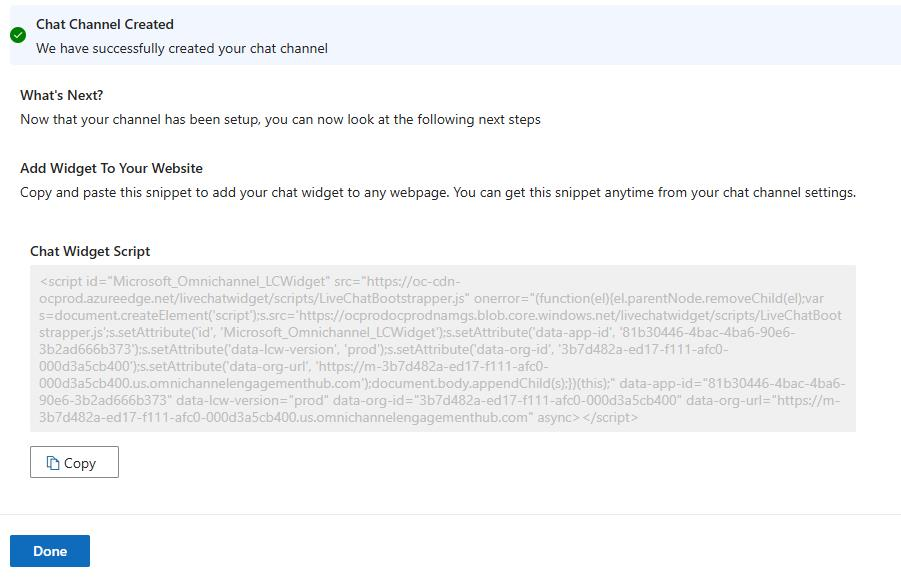

## Task 08: Deploy your chat widget to a portal

After your chat channel has completed, you'll be able to deploy it to your organizations portal. On the channel setup complete screen, you'll be provided with a code snippet that you can use to deploy to the portal.

-  On the channel setup complete page, select **Copy** and then select **Done**.

-  In a new tab within the same browser session, go to `https://make.powerapps.com`.

-  In the left pane, select **Apps** and then select **Portal Management**.

-  In the **Portal Management** app, in the **Content** section, select **Content Snippets**.

-  In the **Search for Records** Box, enter `Chat` and press **Enter**. Open the **Chat Widget Code** content snippet for your customer service portal.

-  In the **Value (HTML)** field, paste the code that you copied  when you deployed the widget.

-  Select **Save and Close**.

> 
>   It can take up to 15 minutes before you'll see the chat widget available on your portal.

> 

---
