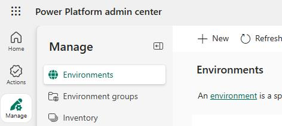
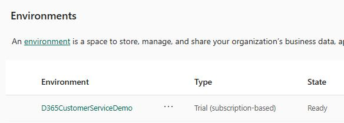
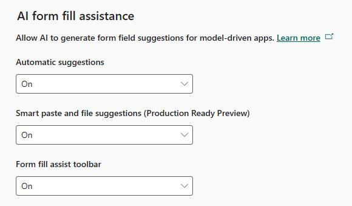

### Task 01: Enable AI form fill assistance

---

#### 01: Enable form fill assistance

-  In Edge, go to `https://admin.powerplatform.microsoft.com`.

-  If prompted, sign in by using the administrator credentials for your demo enviornment.

-  In the left pane, select **Manage**.

-  In the **Manage** pane, select **Environments**.

-  On the **Environments** page, select your demo environment.

-  On the command bar, select **Settings**.

-  Expand **Product**, and then select **Features**.

-  Move down the page to locate the **AI form fill assistance** section. Configure the section as follows:

**Automatic suggestions**: On

- **Smart paste and file suggestions (Production Ready Preview)**: On

- **Form fill assist toolbar**: On

-  Select **Save**.
